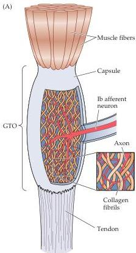
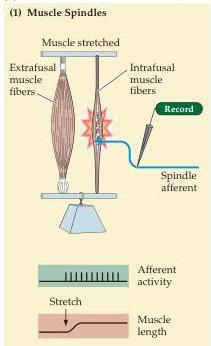
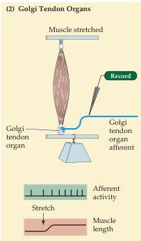
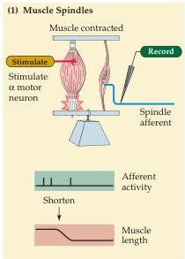
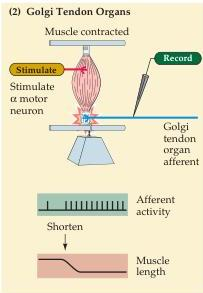

Lower Motor Neuron Circuits and Motor Control 383

lated afferent nerve endings located at the junction of a muscle and tendon (Figure 15.11A; see also Table 9.1).
Each tendon organ is innervated by a single group Ib sensory axon (the Ib axons are slightly smaller than the Ia axons that innervate the muscle spindles).
In contrast to the parallel arrangement of extrafusal muscle fibers and spindles, Golgi tendon organs are in series with the extrafusal muscle fibers.
When a muscle is passively stretched, most of the change in length occurs in the muscle fibers, since they are more elas-

Figure 15.11 Comparison of the function of muscle spindles and Golgi tendon organs.
(A) Golgi tendon organs are arranged in series with extrafusal muscle fibers because of their location at the junction of muscle and tendon.
(B) The two types of muscle receptors, the muscle spindles (1) and the Golgi tendon organs (2), have different responses to passive muscle stretch (top) and active muscle contraction (bottom).
Both afferents discharge in response to passively stretching the muscle, although the Golgi tendon organ discharge is much less than that of the spindle.
When the extrafusal muscle fibers are made to contract by stimulation of their motor neurons, however, the spindle is unloaded and therefore falls silent, whereas the rate of Golgi tendon organ firing increases.
(B after Patton, 1965.)

(B)
MUSCLE PASSIVELY STRETCHED

MUSCLE ACTIVELY CONTRACTED

