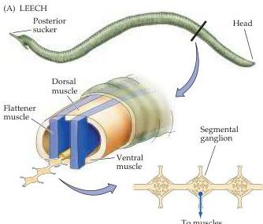
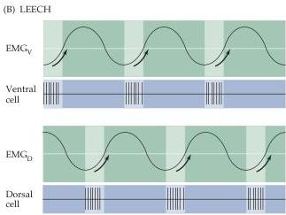

Chapter Fifteen

# Box A

## Locomotion in the Leech and the Lamprey

All animals must coordinate body movements so they can navigate successfully in their environment.
All vertebrates, including mammals, use local circuits in the spinal cord (central pattern generators) to control the coordinated movements associated with locomotion.
The cellular basis of organized locomotor activity, however, has been most thoroughly studied in an invertebrate, the leech, and a simple vertebrate, the lamprey.

Both the leech and the lamprey lack peripheral appendages for locomotion possessed by many vertebrates (limbs, flippers, fins, or their equivalent).
Furthermore, their bodies comprise repeating muscle segments (as well as repeating skeletal elements in the lamprey).
Thus, in order to move through the water, both animals must coordinate the movement of each segment.
They do this by orchestrating a sinusoidal displacement of each body segment in sequence, so that the animal is propelled forward through the water.

The leech is particularly well-suited for studying the circuit basis of coordinated movement.
The nervous system in the leech consists of a series of interconnected segmental ganglia, each with motor neurons that innervate the corresponding segmental muscles (Figure A).
These segmental ganglia facilitate electrophysiological studies, because there is a limited number of neurons in each and each neuron has a distinct identity.
The neurons can thus be recognized and studied from animal to animal, and their electrical activity correlated with the sinusoidal swimming movements.

A central pattern generator circuit coordinates this undulating motion.
In the leech, the relevant neural circuit is an ensemble of sensory neurons, interneurons, and motor neurons repeated in each segmental ganglion that controls the local sequence of contraction and relaxation in each segment of the body wall musculature (Figure B).
The sensory neurons detect the stretching and contraction of the body wall associated with the sequential swimming movements.
Dorsal and ventral motor neurons in the circuit provide innervation to dorsal and ventral muscles, whose phasic contractions propel the leech forward.
Sensory information and motor neuron signals are coordinated by interneurons that fire rhythmically, setting up phasic patterns of activity in the dorsal and ventral cells that lead to sinusoidal movement.
The intrinsic swimming rhythm is established by a variety of membrane conductances that mediate periodic bursts of suprathreshold action potentials followed by well-defined periods of hyperpolarization.

The lamprey, one of the simplest vertebrates, is distinguished by its clearly

(A) The leech propels itself through the water by sequential contraction and relaxation of the body wall musculature of each segment.
The segmental ganglia in the ventral midline coordinate swimming, each ganglion containing a population of identified neurons.
(B) Electrical recordings from the ventral $(\mathrm{EMG}_{\mathrm{V}})$ and dorsal $(\mathrm{EMG}_{\mathrm{D}})$ muscles in the leech and the corresponding motor neurons show a reciprocal pattern of excitation for the dorsal and ventral muscles of a given segment.

