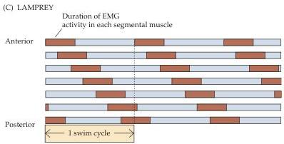
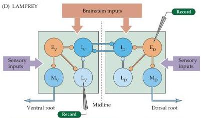
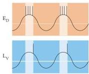

Lower Motor Neuron Circuits and Motor Control 385

segmented musculature and by its lack of bilateral fins or other appendages.
In order to move through the water, the lamprey contracts and relaxes each muscle segment in sequence (Figure C), which produces a sinusoidal motion, much like that of the leech.
Again, a central pattern generator coordinates this sinusoidal movement.

Unlike the leech with its segmental ganglia, the lamprey has a continuous spinal cord that innervates its muscle segments.
The lamprey spinal cord is simpler than that of other vertebrates, and several classes of identified neurons occupy stereotyped positions.
This orderly arrangement again facilitates the identification and analysis of neurons that constitute the central pattern generator circuit.

In the lamprey spinal cord, the intrinsic firing pattern of a set of interconnected sensory neurons, interneurons and motor neurons establishes the pattern of undulating muscle contractions that underlie swimming (Figure D).
The patterns of connectivity between neurons, the neurotransmitters used by each class of cell, and the physiological properties of the elements in the lamprey pattern generator are now known.
Different neurons in the circuit fire with distinct rhythmicity, thus controlling specific aspects of the swim cycle (Figure E).
Particularly important are reciprocal inhibitory connections across the midline that coordinate the pattern generating circuitry on each side of the spinal cord.
This circuitry in the lamprey thus provides a basis for understanding the circuits that control locomotion in more complex vertebrates.

These observations on pattern generating circuits for locomotion in relatively simple animals have stimulated parallel studies of terrestrial mammals in which central pattern generators in the spinal cord also coordinate locomotion.
Although different in detail, terrestrial locomotion ultimately relies on the sequential movements similar to those that propel the leech and the lamprey through aquatic environments, and intrinsic physiological properties of spinal cord neurons that establish rhythmicity for coordinated movement.

# References

GRILLNER, S., D.
PARKER AND A.
EL MANIRA (1998) Vertebrate locomotion: A lamprey perspective.
Ann.
N.Y.
Acad.
Sci.
860: 1-18.
MARDER, E.
AND R.
M.
CALABRESE (1996) Principles of rhythmic motor pattern generation.
Physiol.
Rev.
76: 687-717.
STENT, G.
S., W.
B.
KRISTAN, W.
O.
FRIESEN, C.
A.
ORT, M.
POON AND R.
M.
CALABRESE (1978) Neural generation of the leech swimming movement.
Science 200: 1348-1357.

(C) In the lamprey, as this diagram indicates, the pattern of activity across segments is also highly coordinated.
(D) The elements of the central pattern generator in the lamprey have been worked out in detail, providing a guide to understanding homologous circuitry in more complex spinal cords.
(E) As in the leech, different patterns of electrical activity in lamprey spinal neurons (neurons  $\mathrm{E}_{\mathrm{D}}$  and  $\mathrm{L}_{\mathrm{V}}$  in this example) correspond to distinct periods in the sequence of muscle contractions related to the swim cycle.

