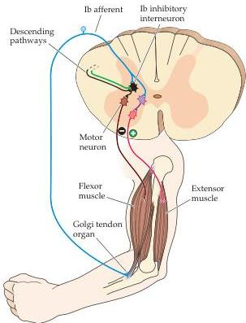

Chapter Fifteen

tic than the fibrils of the tendon.
When a muscle actively contracts, however, the force acts directly on the tendon, leading to an increase in the tension of the collagen fibrils in the tendon organ and compression of the intertwined sensory receptors.
As a result, Golgi tendon organs are exquisitely sensitive to increases in muscle tension that arise from muscle contraction but, unlike spindles, are relatively insensitive to passive stretch (Figure 15.11B).

The Ib axons from Golgi tendon organs contact inhibitory local circuit neurons in the spinal cord (called Ib inhibitory interneurons) that synapse, in turn, with the $\alpha$ motor neurons that innervate the same muscle.
The Golgi tendon circuit is thus a negative feedback system that regulates muscle tension; it decreases the activation of a muscle when exceptionally large forces are generated and this way protects the muscle.
This reflex circuit also operates at reduced levels of muscle force, counteracting small changes in muscle tension by increasing or decreasing the inhibition of $\alpha$ motor neurons.
Under these conditions, the Golgi tendon system tends to maintain a steady level of force, counteracting effects that diminish muscle force (such as fatigue).
In short, the muscle spindle system is a feedback system that monitors and maintains muscle length, and the Golgi tendon system is a feedback system that monitors and maintains muscle force.

Like the muscle spindle system, the Golgi tendon organ system is not a closed loop.
The Ib inhibitory interneurons also receive synaptic inputs from a variety of other sources, including cutaneous receptors, joint receptors, muscle spindles, and descending upper motor neuron pathways (Figure 15.12).
Acting in concert, these inputs regulate the responsiveness of Ib interneurons to activity arising in Golgi tendon organs.

Figure 15.12 Negative feedback regulation of muscle tension by Golgi tendon organs.
The Ib afferents from tendon organs contact inhibitory interneurons that decrease the activity of $\alpha$ motor neurons innervating the same muscle.
The Ib inhibitory interneurons also receive input from other sensory fibers, as well as from descending pathways.
This arrangement prevents muscles from generating excessive tension.