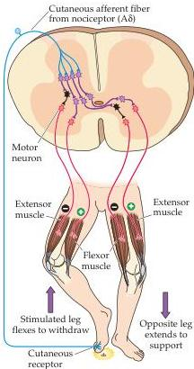

Lower Motor Neuron Circuits and Motor Control 387

# Flexion Reflex Pathways

So far, the discussion has focused on reflexes driven by sensory receptors located within muscles or tendons.
Other reflex circuitry mediates the withdrawal of a limb from a painful stimulus, such as a pinprick or the heat of a flame.
Contrary to what might be imagined given the speed with which we are able to withdraw from a painful stimulus, this flexion reflex involves several synaptic links (Figure 15.13).
As a result of activity in this circuitry, stimulation of nociceptive sensory fibers leads to withdrawal of the limb from the source of pain by excitation of ipsilateral flexor muscles and reciprocal inhibition of ipsilateral extensor muscles.
Flexion of the stimulated limb is also accompanied by an opposite reaction in the contralateral limb (i.e., the contralateral extensor muscles are excited while flexor muscles are inhibited).
This crossed extension reflex provides postural support during withdrawal of the affected limb from the painful stimulus.

Like the other reflex pathways, local circuit neurons in the flexion reflex pathway receive converging inputs from several different sources, including other spinal cord interneurons and upper motor neuron pathways.
Although the functional significance of this complex pattern of connectivity is unclear, changes in the character of the reflex following damage to descending pathways provides some insight.
Under normal conditions, a noxious stimulus is required to evoke the flexion reflex; following damage to descending pathways, however, other types of stimulation, such as squeezing a limb, can sometimes produce the same response.
This observation suggests that the descending projections to the spinal cord modulate the responsiveness of the local circuitry to a variety of sensory inputs.

# Spinal Cord Circuitry and Locomotion

The contribution of local circuitry to motor control is not, of course, limited to reflexive responses to sensory inputs.
Studies of rhythmic movements such as locomotion and swimming in animal models (Box A) have demonstrated that local circuits in the spinal cord called central pattern generators are fully capable of controlling the timing and coordination of such complex patterns of movement, and of adjusting them in response to altered circumstances (Box B).

A good example is locomotion (walking, running, etc.).
The movement of a single limb during locomotion can be thought of as a cycle consisting of two phases: a stance phase, during which the limb is extended and placed in contact with the ground to propel humans or other bipeds forward; and a swing phase, during which the limb is flexed to leave the ground and then brought forward to begin the next stance phase (Figure 15.14A).
Increases in the speed of locomotion reduce the amount of time it takes to complete a cycle, and most of the change in cycle time is due to shortening the stance phase; the swing phase remains relatively constant over a wide range of locomotor speeds.

In quadrupeds, changes in locomotor speed are also accompanied by changes in the sequence of limb movements.
At low speeds, for example, there is a back-to-front progression of leg movements, first on one side and then on the other.
As the speed increases to a trot, the movements of the right forelimb and left hindlimb are synchronized (as are the movements of the left forelimb and right hindlimb).
At the highest speeds (gallop), the movements of the two front legs are synchronized, as are the movements of the two hindlimbs (Figure 15.14B).

Given the precise timing of the movement of individual limbs and the coordination among limbs that are required in this process, it is natural to

Figure 15.13 Spinal cord circuitry responsible for the flexion reflex.
Stimulation of cutaneous receptors in the foot (by stepping on a tack in this example) leads to activation of spinal cord local circuits that withdraw (flex) the stimulated extremity and extend the other extremity to provide compensatory support.