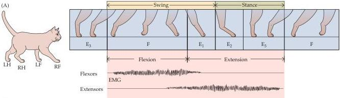
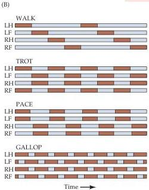
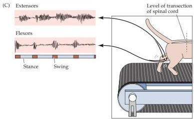

Chapter Fifteen

Figure 15.14 The cycle of locomotion for terrestrial mammals (a cat in this instance) is organized by central pattern generators.
(A) The step cycle, showing leg flexion (F) and extension (E) and their relation to the swing and stance phases of locomotion.
EMG indicates electromyographic recordings.
(B) Comparison of the stepping movements for different gaits.
Brown bars, foot lifted (swing phase); gray bars, foot planted (stance phase).
(C) Transection of the spinal cord at the thoracic level isolates the hindlimb segments of the cord.
The hindlimbs are still able to walk on a treadmill after recovery from surgery, and reciprocal bursts of electrical activity can be recorded from flexors during the swing phase and from extensors during the stance phase of walking.
(After Pearson, 1976.)

Damage to lower motor neuron cell bodies or their peripheral axons results in paralysis (loss of movement) or paresis (weakness) of the affected muscles, depending on the extent of the damage.
In addition to paralysis and/or paresis, the lower motor neuron syndrome includes a loss of reflexes (areflexia) due to interruption of the efferent (motor) limb of the sensory motor reflex arcs.
Damage to lower motor neurons also entails a loss of muscle tone, since tone is in part dependent on the monosynaptic reflex arc that links the muscle spindles to the lower motor neurons (see also Box D in Chapter 16).
A somewhat later effect is atrophy of the affected muscles due to denervation and disuse.
The muscles involved may also exhibit fibrillations and fasciculations, which are spontaneous twitches characteristic of single denervated muscle fibers or motor units, respectively.
These phenomena arise from changes in the excitability of denervated muscle fibers in the case of fibrillation, and from abnormal activity of injured  $\alpha$  motor neurons in the case of fasciculations.
These spontaneous contractions can be readily recognized in an electromyogram, providing an especially helpful clinical tool in diagnosing lower motor neuron disorders (Box C).