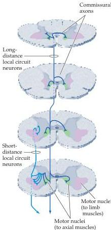

Chapter Sixteen

Figure 16.1 Local circuit neurons that supply the medial region of the ventral horn are situated medially in the intermediate zone of the spinal cord gray matter and have axons that extend over a number of spinal cord segments and terminate bilaterally.
In contrast, local circuit neurons that supply the lateral parts of the ventral horn are located more laterally, have axons that extend over a few spinal cord segments, and terminate only on the same side of the cord.
Descending pathways that contact the medial parts of the spinal cord gray matter are involved primarily in the control of posture; those that contact the lateral parts are involved in the fine control of the distal extremities.

The patterns of connections made by local circuit neurons in the medial region of the intermediate zone are different from the patterns made by those in the lateral region, and these differences are related to their respective functions (Figure 16.1).
The medial local circuit neurons, which supply the lower motor neurons in the medial ventral horn, have axons that project to many spinal cord segments; indeed, some project to targets along the entire length of the cord.
Moreover, many of these local circuit neurons also have axonal branches that cross the midline in the commissure of the spinal cord to innervate lower motor neurons in the medial part of the contralateral hemicord.
This arrangement ensures that groups of axial muscles on both sides of the body act in concert to maintain and adjust posture.
In contrast, local circuit neurons in the lateral region of the intermediate zone have shorter axons that typically extend fewer than five segments and are predominantly ipsilateral.
This more restricted pattern of connectivity underlies the finer and more differentiated control that is exerted over the muscles of the distal extremities, such as that required for the independent movement of individual fingers during manipulative tasks.

Differences in the way upper motor neuron pathways from the cortex and brainstem terminate in the spinal cord conform to these functional distinctions between the local circuits that organize the activity of axial and distal muscle groups.
Thus, most upper motor neurons that project to the medial part of the ventral horn also project to the medial region of the intermediate zone; the axons of these upper motor neurons have collateral branches that terminate over many spinal cord segments, reaching medial cell groups on both sides of the spinal cord.
The sources of these projections are primarily the vestibular nuclei and the reticular formation (see next section); as their terminal zones in the medial spinal cord gray matter suggest, they are concerned primarily with postural mechanisms (Figure 16.2).
In contrast, descending axons from the motor cortex generally terminate in lateral parts of the spinal cord gray matter and have terminal fields that are restricted to only a few spinal cord segments (Figure 16.3).
These corticospinal pathways are primarily concerned with precise movements involving more distal parts of the limbs.

Two additional brainstem structures, the superior colliculus and the red nucleus, also contribute upper motor neuron pathways to the spinal cord (rubro means red; the adjective is derived from the rich capillary bed that gives the nucleus a reddish color in fresh tissue).
The axons arising from the superior colliculus project to medial cell groups in the cervical cord, where they influence the lower motor neuron circuits that control axial musculature of the neck (see Figure 16.2).
These projections are particularly important in generating orienting movements of the head (the role of the superior colliculus in the generation of head and eye movements is covered in detail in Chapter 19).
The red nucleus projections are also limited to the cervical level of the cord, but these terminate in lateral regions of the ventral horn and intermediate zone (see Figure 16.2).
The axons arising from the red nucleus participate together with lateral corticospinal tract axons in the control of the arms.
The limited distribution of rubrospinal projections may seem surprising, given the large size of the red nucleus in humans.
In fact,

Figure 16.2 Descending projections from the brainstem to the spinal cord.
Pathways that influence motor neurons in the medial part of the ventral horn originate in the reticular formation, vestibular nucleus, and superior colliculus.
Those that influence motor neurons that control the proximal arm muscles originate in the red nucleus and terminate in more lateral parts of the ventral horn.