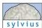

Upper Motor Neuron Control of the Brainstem and Spinal Cord 397

Figure 16.3 Direct and indirect pathways from the motor cortex to the spinal cord.
Neurons in the motor cortex that supply the lateral part of the ventral horn (A) to initiate movements of the distal limbs also terminate on neurons in the reticular formation (B) to mediate postural adjustments that support the movement.
The reticulospinal pathway terminates in the medial parts of the ventral horn, where lower motor neurons that innervate axial muscles are located.
Thus, the motor cortex has both direct and indirect routes by which it can influence the activity of spinal cord neurons.

the bulk of the red nucleus in humans is a subdivision that does not project to the spinal cord at all, but relays information from the cortex to the cerebellum (see Chapter 18).

# Motor Control Centers in the Brainstem: Upper Motor Neurons That Maintain Balance and Posture

As described in Chapter 13, the vestibular nuclei are the major destination of the axons that form the vestibular division of the eighth cranial nerve; as such, they receive sensory information from the semicircular canals and the otolith organs that specifies the position and angular acceleration of the head.
Many of the cells in the vestibular nuclei that receive this information are upper motor neurons with descending axons that terminate in the medial region of the spinal cord gray matter, although some extend more laterally to contact the neurons that control the proximal muscles of the limbs.
The projections from the vestibular nuclei that control axial muscles and those that influence proximal limb muscles originate from different cells and take different routes (called the medial and lateral vestibulospinal tracts).
Other upper motor neurons in the vestibular nuclei project to lower motor neurons in the cranial nerve nuclei that control eye movements (the third, fourth, and sixth cranial nerve nuclei).
This pathway produces the eye movements that maintain fixation while the head is moving (see Chapters 13 and 19).

The reticular formation is a complicated network of circuits located in the core of the brainstem that extends from the rostral midbrain to the caudal medulla and is similar in structure and function to the intermediate gray matter in the spinal cord (see Figure 16.4 and Box A).
Unlike the well-defined sensory and motor nuclei of the cranial nerves, the reticular formation comprises clusters of neurons scattered among a welter of interdigitating axon bundles; it is therefore difficult to subdivide anatomically.
The neurons within the reticular formation have a variety of functions, including cardiovascular and respiratory control (see Chapter 20), governance of myriad sensory motor reflexes (see Chapter 15), the organization of eye movements (see Chapter 19), regulation of sleep and wakefulness (see Chapter 27), and, most important for present purposes, the temporal and spatial coordination of movements.
The descending motor control pathways from the reticular formation to the spinal cord are similar to those of the vestibular nuclei; they terminate primarily in the medial parts of the gray matter where they influence the local circuit neurons that coordinate axial and proximal limb muscles (see Figure 16.2).

Both the vestibular nuclei and the reticular formation provide information to the spinal cord that maintains posture in response to environmental (or self-induced) disturbances of body position and stability.
As expected, the vestibular nuclei make adjustments in posture and equilibrium in response to infor