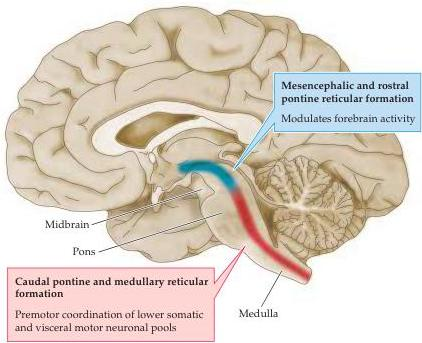

Upper Motor Neuron Control of the Brainstem and Spinal Cord 399

Sylvius

Midsagittal view of the brain showing the longitudinal extent of the reticular formation and highlighting the broad functional roles performed by neuronal clusters in its rostral (blue) and caudal (red) sectors.

output of neurons in the nucleus ambiguus and the dorsal motor nucleus of the vagus nerve.
Still other clusters organize more complex activities that require the coordination of both somatic motor and visceral motor outflow, such as gagging and vomiting, and even laughing and crying.

One set of neuronal clusters that does not fit easily into this rostral-caudal framework is the set of neurons that give rise to the reticulospinal projections.
As described in the text, these neurons are distributed in both rostral and caudal sectors of the reticular formation and they give rise to long-range projections

that innervate lower motor neuronal pools in the medial ventral horn of the spinal cord.
The reticulospinal inputs serve to modulate the gain of segmental reflexes involving the muscles of the trunk and proximal limbs and to initiate certain stereotypical patterns of limb movement.

In summary, the reticular formation is best viewed as a heterogeneous collection of distinct neuronal clusters in the brainstem tegmentum that either modulate the excitability of distant neurons in the forebrain and spinal cord or coordinate the firing patterns of more local lower motor neuronal pools engaged in reflexive or stereotypical somatic motor and visceral motor behavior.

# References

BLESSING, W.
W.
(1997) Inadequate frameworks for understanding bodily homeostasis.
Trends Neurosci.
20: 235-239
HOLSTEGE, G., R.
BANDLER AND C.
B.
SAPER (EDS.) (1996) Progress in Brain Research, Vol.
107.
Amsterdam: Elsevier.
LOEWY, A.
D.
AND K.
M.
SPYER (EDS.) (1990) Central Regulation of Autonomic Functions.
New York: Oxford.
MASON, P.
(2001) Contributions of the medullary raphe and ventromedial reticular region to pain modulation and other homeostatic functions.
Annu.
Rev.
Neurosci.
24: 737-777.
MOBUZZI, G.
AND H.
W.
MAGOUN (1949) Brain stem reticular formation and activation of the EEG.
EEG Clin.
Neurophys.
1: 455-476.

mation from the inner ear.
Direct projections from the vestibular nuclei to the spinal cord ensure a rapid compensatory response to any postural instability detected by the inner ear (see Chapter 13).
In contrast, the motor centers in the reticular formation are controlled largely by other motor centers in the cortex or brainstem.
The relevant neurons in the reticular formation initiate adjustments that stabilize posture during ongoing movements.

The way the upper motor neurons of the reticular formation maintain posture can be appreciated by analyzing their activity during voluntary movements.
Even the simplest movements are accompanied by the activation of muscles that at first glance seem to have little to do with the primary purpose of the movement.
For example, Figure 16.5 shows the pattern of muscle activity that occurs as a subject uses his arm to pull on a handle in response to an auditory tone.
Activity in the biceps muscle begins about 200