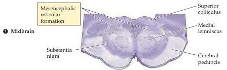
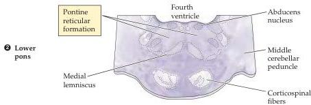
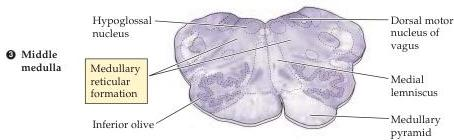
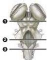

Chapter Sixteen

Figure 16.4 The location of the reticular formation in relation to some other major landmarks at different levels of the brainstem.
Neurons in the reticular formation are scattered among the axon bundles that course through the medial portion of the midbrain, pons, and medulla (see Box A).

ms after the tone.
However, as the records show, the contraction of the biceps is accompanied by a significant increase in the activity of a proximal leg muscle, the gastrocnemius (as well as many other muscles not monitored in the experiment).
In fact, contraction of the gastrocnemius muscle begins well before contraction of the biceps.

These observations show that postural control entails an anticipatory, or feedforward, mechanism (Figure 16.6).
As part of the motor plan for moving the arm, the effect of the impending movement on body stability is "evaluated" and used to generate a change in the activity of the gastrocnemius muscle.
This change actually precedes and provides postural support for the movement of the arm.
In the example given in Figure 16.5, contraction of the biceps would tend to pull the entire body forward, an action that is opposed by the contraction of the gastrocnemius muscle.
In short, this feedforward mechanism "predicts" the resulting disturbance in body stability and generates an appropriate stabilizing response.

The importance of the reticular formation for feedforward mechanisms of postural control has been explored in more detail in cats trained to use a forepaw to strike an object.
As expected, the forepaw movement is accompanied by feedforward postural adjustments in the other legs to maintain the animal upright.
These adjustments shift the animal's weight from an even distribution over all four feet to a diagonal pattern, in which the weight is carried mostly by the contralateral, nonreaching forelimb and the ipsilateral hindlimb.
Lifting of the forepaw and postural adjustments in the other limbs can also be