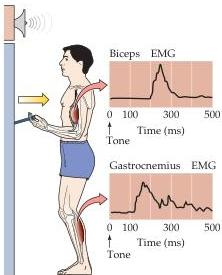
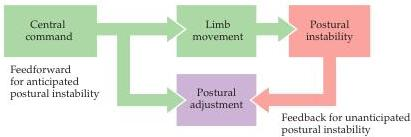

Upper Motor Neuron Control of the Brainstem and Spinal Cord 401

induced in an alert cat by electrical stimulation of the motor cortex.
After pharmacological inactivation of the reticular formation, however, electrical stimulation of the motor cortex evokes only the forepaw movement, without the feedforward postural adjustments that normally accompany them.

The results of this experiment can be understood in terms of the fact that the upper motor neurons in the motor cortex influence the spinal cord circuits by two routes: direct projections to the spinal cord and indirect projections to brainstem centers that in turn project to the spinal cord (see Figure 16.3).
The reticular formation is one of the major destinations of these latter projections from the motor cortex; thus, cortical upper motor neurons initiate both the reaching movement of the forepaw and also the postural adjustments in the other limbs necessary to maintain body stability.
The forepaw movement is initiated by the direct pathway from the cortex to the spinal cord (and possibly by the red nucleus as well), whereas the postural adjustments are mediated via pathways from the motor cortex that reach the spinal cord indirectly, after an intervening relay in the reticular formation (the corticoreticulospinal pathway).

Further evidence for the contrasting functions of the direct and indirect pathways from the motor cortex and brainstem to the spinal cord comes from experiments carried out by the Dutch neurobiologist Hans Kuypers, who examined the behavior of rhesus monkeys that had the direct pathway to the spinal cord transected at the level of the medulla, leaving the indirect descending upper motor neuron pathways to the spinal cord via the brainstem centers intact.
Immediately after the surgery, the animals were able to use axial and proximal muscles to stand, walk, run, and climb, but they had great difficulty using the distal parts of their limbs (especially their hands) independently of other body movements.
For example, the monkeys could cling to the cage but were unable to reach toward and pick up food with their fingers; rather, they used the entire arm to sweep the food toward them.
After several weeks, the animals recovered some independent use of their hands and were again able to pick up objects of interest, but this action still involved the concerted closure of all of the fingers.
The ability to make independent, fractionated movements of the fingers, as in opposing the movements of the fingers and thumb to pick up an object, never returned.
These observations show that following damage to the direct corticospinal pathway at the level of the medulla, the indirect projections from the motor cortex via the brainstem centers (or from brainstem centers alone) are capable of sustaining motor behavior that involves primarily the use of proximal muscles.
In contrast, the direct projections from the motor cortex to the spinal cord provide the speed and agility of movements, enabling a higher degree of precision in fractionated finger movements than is possible using the indirect pathways alone.

Figure 16.5 Anticipatory maintenance of body posture.
At the onset of a tone, the subject pulls on a handle, contracting the biceps muscle.
To ensure postural stability, contraction of the gastrocnemius muscle precedes that of the biceps.
EMG refers to the electromyographic recording of muscle activity.

Figure 16.6 Feedforward and feedback mechanisms of postural control.
Feedforward postural responses are "preprogrammed" and typically precede the onset of limb movement (see Figure 16.4).
Feedback responses are initiated by sensory inputs that detect postural instability.