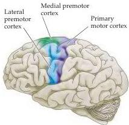
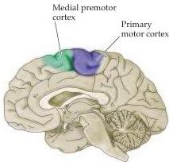

Chapter Sixteen

Selective damage to the corticospinal tract (i.e., the direct pathway) in humans is rarely seen in the clinic.
Nonetheless, this evidence in nonhuman primates showing that direct projections from the cortex to the spinal cord are essential for the performance of discrete finger movements helps explain the limited recovery in humans after damage to the motor cortex or to the internal capsule.
Immediately after such an injury, such patients are typically paralyzed.
With time, however, some ability to perform voluntary movements reappears.
These movements, which are presumably mediated by the brainstem centers, are crude for the most part, and the ability to perform discrete finger movements such as those required for writing, typing, or buttoning typically remains impaired.

## The Corticospinal and Corticobulbar Pathways: Upper Motor Neurons That Initiate Complex Voluntary Movements

The upper motor neurons in the cerebral cortex reside in several adjacent and highly interconnected areas in the frontal lobe, which together mediate the planning and initiation of complex temporal sequences of voluntary movements.
These cortical areas all receive regulatory input from the basal ganglia and cerebellum via relays in the ventrolateral thalamus (see Chapters 17 and 18), as well as inputs from the somatic sensory regions of the parietal lobe (see Chapter 8).
Although the phrase "motor cortex" is sometimes used to refer to these frontal areas collectively, more commonly it is restricted to the primary motor cortex, which is located in the precentral gyrus (Figure 16.7).
The primary motor cortex can be distinguished from the adjacent "premotor" areas both cytoarchitectonically (it is area 4 in Brodmann's nomenclature) and by the low intensity of current necessary to elicit movements by electrical stimulation in this region.
The low threshold for eliciting movements is an indicator of a relatively large and direct pathway from the primary area to the lower motor neurons of the brainstem and spinal cord.
This section and the next focus on the organization and functions of the primary motor cortex and its descending pathways, whereas the subsequent section addresses the contributions of the adjacent premotor areas.

The pyramidal cells of cortical layer V (also called Betz cells) are the upper motor neurons of the primary motor cortex.
Their axons descend to the brainstem and spinal motor centers in the corticobulbar and corticospinal tracts, passing through the internal capsule of the forebrain to enter the cerebral peduncle at the base of the midbrain (Figure 16.8).
They then

Figure 16.7 The primary motor cortex and the premotor area in the human cerebral cortex as seen in lateral (A) and medial (B) views.
The primary motor cortex is located in the precentral gyrus; the premotor area is more rostral.

(A) Lateral view

(B) Medial view