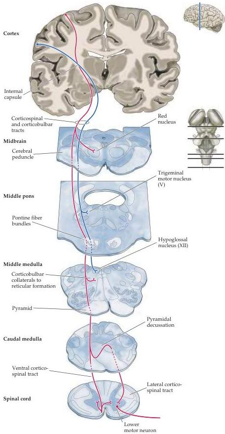

Upper Motor Neuron Control of the Brainstem and Spinal Cord 403

Figure 16.8 The corticospinal and corticobulbar tracts.
Neurons in the motor cortex give rise to axons that travel through the internal capsule and coalesce on the ventral surface of the midbrain, within the cerebral peduncle.
These axons continue through the pons and come to lie on the ventral surface of the medulla, giving rise to the pyramids.
Most of these pyramidal fibers cross in the caudal part of the medulla to form the lateral corticospinal tract in the spinal cord.
Those axons that do not cross form the ventral corticospinal tract.

