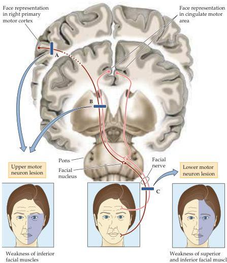
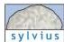

Chapter Sixteen

# Box B

## Patterns of Facial Weakness and Their Importance for Localizing Neurological Injury

The signs and symptoms pertinent to the cranial nerves and their nuclei are of special importance to clinicians seeking to pinpoint the neurological lesions that produce motor deficits.
An especially instructive example is provided by the muscles of facial expression.
It has long been recognized that the distribution of facial weakness provides important localizing clues indicating whether the underlying injury involves lower motor neurons in the facial motor nucleus (and/or their axons in the facial nerve) or the inputs that govern these neurons, which arise from upper motor neurons in the cerebral cortex.
Damage to the facial motor nucleus or its nerve affects all the muscles of facial expression on the side of the lesion (lesion C in the figure); this is expected given the intimate anatomical and functional linkage between lower motor neurons and skeletal muscles.
A pattern of impairment that is more difficult to explain accompanies unilateral injury to the motor areas in the lateral frontal lobe (primary motor cortex, lateral premotor cortex), as occurs strokes that involve the middle cerebral artery (lesion A in the figure).
Most patients with such injuries have difficulty controlling the contralateral muscles around the mouth but retain the ability to symmetrically raise their eyebrows, wrinkle their forehead, and squint.

Until recently, it was assumed that this pattern of inferior facial paresis with superior facial sparing could be attributed to (presumed) bilateral projections from the face representation in the primary motor cortex to the facial motor nucleus; in this conception, the intact ipsilateral corticobulbar projections were considered sufficient to motivate the contractions of the superior muscles of the face.
However, recent tract-tracing studies in non-human primates have suggested a different explanation.
These studies demonstrate two important facts that clarify the relations among the face representations in the cerebral cortex and the facial motor nucleus.
First, the corticobulbar projections of the primary motor cortex are directed predominantly toward the lateral cell columns in the contralateral facial motor nucleus, which control the movements of the perioral musculature.
Thus, the more dorsal cell columns in the facial motor nucleus that innervate superior facial muscles do not receive significant input from the primary motor cortex.
Second, these dorsal cell columns are governed by an access

Organization of projections from cerebral cortex to the facial motor nucleus and the effects of upper and lower motor neuron lesions.