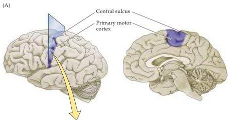
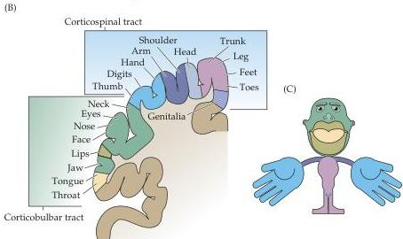

Chapter Sixteen

Jackson reached this conclusion from his observation that the abnormal movements during some types of epileptic seizures "march" systematically from one part of the body to another.
For instance, partial motor seizures may start with abnormal movements of a finger, progress to involve the entire hand, then the forearm, the arm, the shoulder, and, finally, the face.

This early evidence for motor maps in the cortex was confirmed shortly after the turn of the nineteenth century when Charles Sherrington published his classical maps of the organization of the motor cortex in great apes, using focal electrical stimulation.
During the 1930s, one of Sherrington's students, the American neurosurgeon Wilder Penfield, extended this work by demonstrating that the human motor cortex also contains a spatial map of the body's musculature.
By correlating the location of muscle contractions with the site of electrical stimulation on the surface of the motor cortex (the same method used by Sherrington), Penfield mapped the representation of the muscles in the precentral gyrus in over 400 neurosurgical patients (Figure 16.9).
He found that this motor map shows the same disproportions observed in the somatic sensory maps in the postcentral gyrus (see Chapter 8).
Thus, the musculature used in tasks requiring fine motor control (such as movements of the face and hands) occupies a greater amount of space in the

Figure 16.9 Topographic map of the body musculature in the primary motor cortex.
(A) Location of primary motor cortex in the precentral gyrus.
(B) Section along the precentral gyrus, illustrating the somatotopic organization of the motor cortex.
The most medial parts of the motor cortex are responsible for controlling muscles in the legs; the most lateral portions are responsible for controlling muscles in the face.
(C) Disproportional representation of various portions of the body musculature in the motor cortex.
Representations of parts of the body that exhibit fine motor control capabilities (such as the hands and face) occupy a greater amount of space than those that exhibit less precise motor control (such as the trunk).

