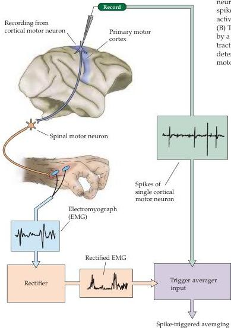
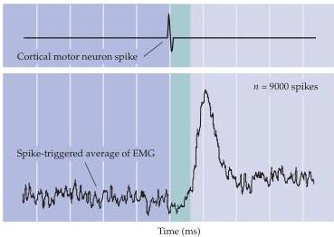

Upper Motor Neuron Control of the Brainstem and Spinal Cord 409

(A) Detection of postspike facilitation
(B) Postspike facilitation by cortical motor neuron

Figure 16.10 The influence of single cortical upper motor neurons on muscle activity.
(A) Diagram illustrates the spike triggering average method for correlating muscle activity with the discharges of single upper motor neurons.
(B) The response of a thumb muscle (bottom trace) follows by a fixed latency the single spike discharge of a pyramidal tract neuron (top trace).
This technique can be used to determine all the muscles that are influenced by a given motor neuron (see text).
(After Porter and Lemon, 1993.)