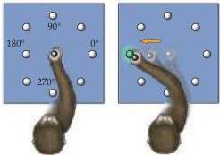
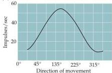
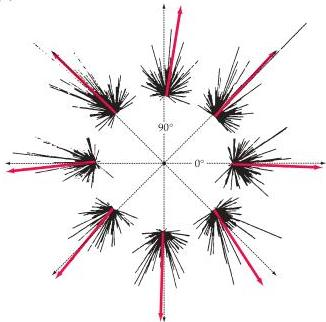
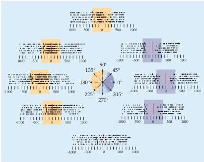

Upper Motor Neuron Control of the Brainstem and Spinal Cord 411

(A)

(C)

(D)

neurons in the lateral premotor cortex have responses that are linked in time to the occurrence of movements; as in the primary motor area, many of these cells fire most strongly in association with movements made in a specific direction.
However, these neurons are especially important in conditional motor tasks.
That is, in contrast to the neurons in the primary motor area, when a monkey is trained to reach in different directions in response to a

(B)

Figure 16.11 Directional tuning of an upper motor neuron in the primary motor cortex.
(A) A monkey is trained to move a joystick in the direction indicated by a light.
(B) The activity of a single neuron was recorded during arm movements in each of eight different directions (zero indicates the time of movement onset, and each short vertical line in this raster plot represents an action potential).
The activity of the neuron increased before movements between 90 and 225 degrees (yellow zone), but decreased in anticipation of movements between 0 and 315 degrees (purple zone).
(C) Plot showing that the neuron's discharge rate was greatest before movements in a particular direction, which defines the neuron's "preferred direction." (D) The black lines indicate the discharge rate of individual upper motor neurons prior to each direction of movement.
By combining the responses of all the neurons, a "population vector" can be derived that represents the movement direction encoded by the simultaneous activity of the entire population.
(After Georgeopoulos et al., 1986.)