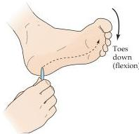
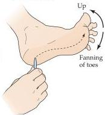

Upper Motor Neuron Control of the Brainstem and Spinal Cord 413

|  Signs and Symptoms of Upper and Lower Motor Neuron Lesions  |   |
| --- | --- |
|  Upper Motor Neuron Syndrome | Lower Motor Neuron Syndrome  |
|  Weakness | Weakness or paralysis  |
|  Spasticity | Decreased superficial reflexes  |
|  Increased tone | Hypoactive deep reflexes  |
|  Hyperactive deep reflexes | Decreased tone  |
|  Clonus | Fasciculations and fibrillations  |
|  Babinski’s sign | Severe muscle atrophy  |
|  Loss of fine voluntary movements |   |

that are affected helps localize the site of the injury.
The acute manifestations tend to be most severe in the arms and legs: If the affected limb is elevated and released, it drops passively, and all reflex activity on the affected side is abolished.
In contrast, control of trunk muscles is usually preserved, either by the remaining brainstem pathways or because of the bilateral projections of the corticospinal pathway to local circuits that control midline musculature.
The initial period of "hypotonia" after upper motor neuron injury is called spinal shock, and reflects the decreased activity of spinal circuits suddenly deprived of input from the motor cortex and brainstem.

After several days, however, the spinal cord circuits regain much of their function for reasons that are not fully understood.
Thereafter, a consistent pattern of motor signs and symptoms emerges, including:

1.
The Babinski sign.
The normal response in an adult to stroking the sole of the foot is flexion of the big toe, and often the other toes.
Following damage to descending upper motor neuron pathways, however, this stimulus elicits extension of the big toe and a fanning of the other toes (Figure 16.12).
A similar response occurs in human infants before the maturation of the corticospinal pathway and presumably indicates incomplete upper motor neuron control of local motor neuron circuitry.

(A) Normal plantar response

(B) Extensor plantar response (Babinski sign)
Figure 16.12 The Babinski sign.
Following damage to descending corticospinal pathways, stroking the sole of the foot causes an abnormal fanning of the toes and the extension of the big toe.