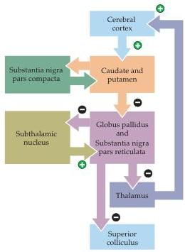
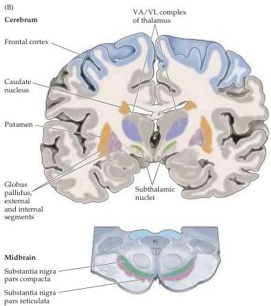

Chapter Seventeen

(A)
Figure 17.1 Motor components of the human basal ganglia.
(A) Basic circuits of the basal ganglia pathway: (+) and (-) denote excitatory and inhibitory connections.
(B) Idealized coronal section through the brain showing anatomical locations of structures involved in the basal ganglia pathway.
Most of these structures are in the telencephalon, although the substantia nigra is in the midbrain and the thalamic and subthalamic nuclei are in the diencephalon.
The ventral anterior and ventral lateral thalamic nuclei (VA/VL complex) are the targets of the basal ganglia, relaying the modulatory effects of the basal ganglia to upper motor neurons in the cortex.

cortex are the dendrites of a class of cells called medium spiny neurons in the corpus striatum (Figure 17.3).
The large dendritic trees of these neurons allow them to integrate inputs from a variety of cortical, thalamic, and brainstem structures.
The axons arising from the medium spiny neurons converge on neurons in the globus pallidus and the substantia nigra pars reticulata.
The globus pallidus and substantia nigra pars reticulata are the main sources of output from the basal ganglia complex.

Nearly all regions of the neocortex project directly to the corpus striatum, making the cerebral cortex the source of the largest input to the basal ganglia by far.
Indeed, the only cortical areas that do not project to the corpus striatum are the primary visual and primary auditory cortices (Figure 17.4).
Of those cortical areas that do innervate the striatum, the heaviest projections are from association areas in the frontal and parietal lobes, but substantial contributions also arise from the temporal, insular, and cingulate cortices.
All of these projections, referred to collectively as the corticostriatal pathway, travel through the internal capsule to reach the caudate and putamen directly (see Figure 17.2).

The cortical inputs to the caudate and putamen are not equivalent, however, and the differences in input reflect functional differences between these two nuclei.
The caudate nucleus receives cortical projections primarily from multimodal association cortices, and from motor areas in the frontal lobe that control eye movements.
As the name implies, the association cortices do not process any one type of sensory information; rather, they receive inputs from a number of primary and secondary sensory cortices and associated