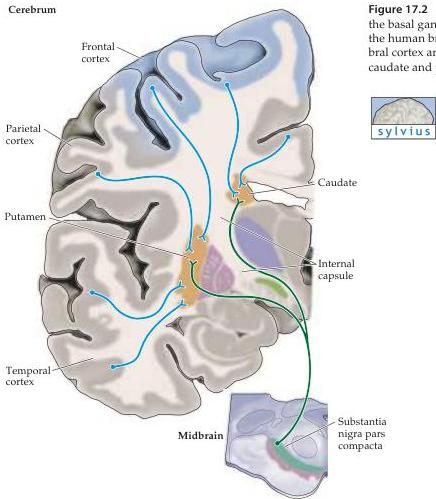

Modulation of Movement by the Basal Ganglia 419

Figure 17.2 Anatomical organization of the inputs to the basal ganglia.
An idealized coronal section through the human brain, showing the projections from the cerebral cortex and the substantia nigra pars comparta to the caudate and putamen.

thalamic nuclei (see Chapter 25).
The putamen, on the other hand, receives input from the primary and secondary somatic sensory cortices in the parietal lobe, the secondary (extrastriate) visual cortices in the occipital and temporal lobes, the premotor and motor cortices in the frontal lobe, and the auditory association areas in the temporal lobe.
The fact that different cortical areas project to different regions of the striatum implies that the corticostriatal pathway consists of multiple parallel pathways serving different functions.
This interpretation is supported by the observation that the segregation is maintained in the structures that receive projections from the striatum, and in the pathways that project from the basal ganglia to other brain regions.

There are other indications that the corpus striatum is functionally subdivided according to its inputs.
For example, visual and somatic sensory cortical projections are topographically mapped within different regions of the putamen.
Moreover, the cortical areas that are functionally interconnected at the level of the cortex give rise to projections that overlap extensively in the striatum.
Anatomical studies by Ann Graybiel and her colleagues at the Massachusetts Institute of Technology have shown that regions of different cortical areas concerned with the hand (see Chapter 8) converge in specific rostrocaudal bands within the striatum; conversely, regions in the same corti