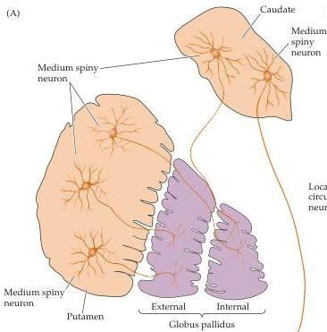
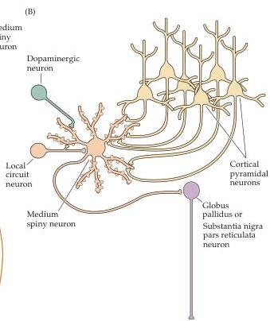

Chapter Seventeen

Figure 17.3 Neurons and circuits of the basal ganglia.
(A) Medium spiny neurons in the caudate and putamen.
(B) Diagram showing convergent inputs onto a medium spiny neuron from cortical neurons, dopaminergic cells of the substantia nigra, and local circuit neurons.
The primary output of the medium spiny cells is to the globus pallidus and to the substantia nigra pars reticulata.

cal areas concerned with the leg converge in other striatal bands.
These rostrocaudal bands therefore appear to be functional units concerned with the movement of particular body parts.
Another study by the same group showed that the more extensively cortical areas are interconnected by corticocortical pathways, the greater the overlap in their projections to the striatum.

A further indication of functional subdivision within the striatum is the spatial distribution of different types of medium spiny neurons.
Although medium spiny neurons are distributed throughout the striatum, they occur in clusters of cells called "patches" or "striosomes," in a surrounding "matrix" of neurochemically distinct cells.
Whereas the distinction between the patches and matrix was originally based only on differences in the types of neuropeptides contained by the medium spiny cells in the two regions, the cell types are now known to differ as well in the sources of their inputs from the cortex and in the destinations of their projections to other parts of the basal ganglia.
For example, even though most cortical areas project to medium spiny neurons in both these compartments, limbic areas of the cortex (such as the cingulate gyrus; see Chapter 28) project more heavily to the patches, whereas motor and somatic sensory areas project preferentially to the neurons in the matrix.
These differences in the connectivity of medium spiny neurons in the patches and matrix further support the conclusion that functionally distinct pathways project in parallel from the cortex to the striatum.