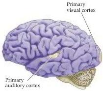
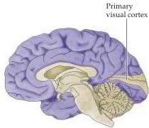

Modulation of Movement by the Basal Ganglia 421

(A) Lateral view

(B) Medial view
Figure 17.4 Regions of the cerebral cortex (shown in purple) that project to the caudate, putamen, and ventral striatum (see Box C) in both lateral (A) and medial (B) views.
The caudate, putamen, and ventral striatum receive cortical projections primarily from the association areas of the frontal, parietal, and temporal lobes.

The nature of the signals transmitted to the caudate and putamen from the cortex is not understood.
It is known, however, that collateral axons of corticocortical, corticothalamic, and corticospinal pathways all form excitatory glutamatergic synapses on the dendritic spines of medium spiny neurons (see Figure 17.3B).
The arrangement of these cortical synapses is such that the number of contacts established between an individual cortical axon and a single medium spiny cell is very small, whereas the number of spiny neurons contacted by a single axon is extremely large.
This divergence of axon terminals allows a single medium spiny neuron to integrate the influences of thousands of cortical cells.

The medium spiny cells also receive noncortical inputs from interneurons, from the midline and intralaminar nuclei of the thalamus, and from brainstem aminergic nuclei.
In contrast to the cortical inputs to the dendritic spines, the local circuit neuron and thalamic synapses are made on the dendritic shafts and close to the cell soma, where they can modulate the effectiveness of cortical synaptic activation arriving from the more distal dendrites.
The aminergic inputs are dopaminergic and they originate in a subdivision of the substantia nigra called pars compacta because of its densely packed cells.
The dopaminergic synapses are located on the base of the spine, in close proximity to the cortical synapses, where they more directly modulate cortical input (see Figure 17.3B).
As a result, inputs from both the cortex and the substantia nigra pars compacta are relatively far from the initial segment of the medium spiny neuron axon, where the nerve impulse is generated.
Accordingly, the medium spiny neurons must simultaneously receive many excitatory inputs from cortical and nigral neurons to become active.
As a result the medium spiny neurons are usually silent.

When the medium spiny neurons do become active, their firing is associated with the occurrence of a movement.
Extracellular recordings show that these neurons typically increase their rate of discharge just before an impending movement.
Neurons in the putamen tend to discharge in anticipation of body movements, whereas caudate neurons fire prior to eye movements.
These anticipatory discharges are evidently part of a movement selection process; in fact, they can precede the initiation of movement by as much as several seconds.
Similar recordings have also shown that the discharges of some striatal neurons vary according to the location in space of the target of a movement, rather than with the starting position of the limb relative to the target.
Thus, the activity of these cells may encode the decision to move toward the target, rather than simply the direction and amplitude of the actual movement necessary to reach the target.