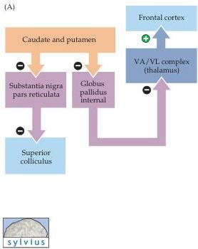
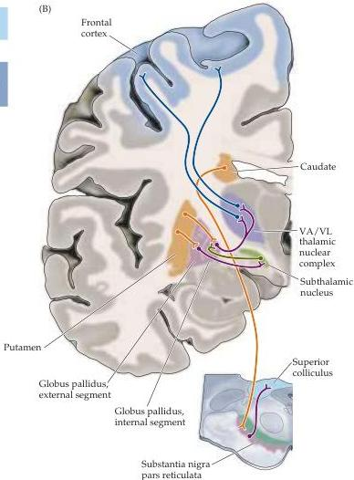

Chapter Seventeen

# Projections from the Basal Ganglia to Other Brain Regions

The medium spiny neurons of the caudate and putamen give rise to inhibitory GABAergic projections that terminate in another pair of nuclei in the basal ganglia complex: the internal division of the globus pallidus and a specific region of the substantia nigra called pars reticulata (because, unlike the pars compacta, axons passing through give it a netlike appearance).
These nuclei are in turn the major sources of the output from the basal ganglia (Figure 17.5).
The globus pallidus and substantia nigra pars reticulata have similar output functions.
In fact, developmental studies show that pars reticulata is actually part of the globus pallidus, although the two eventually become separated by fibers of the internal capsule.
The striatal projections to these two nuclei resemble the corticostriatal pathways in that they terminate in rostrocaudal bands, the locations of which vary with the locations of their sources in the striatum.

A striking feature of the projections from the medium spiny neurons to the globus pallidus and substantia nigra is the degree of their convergence onto pallidal and reticulata cells.
In humans, for example, the corpus striatum contains approximately 100 million neurons, about 75% of which are

Figure 17.5 Functional organization of the outputs from the basal ganglia.
(A) Diagram of the targets of the basal ganglia, including the intermediate relay nuclei (the globus pallidus, internal and external segments, and the subthalamic nucleus), the superior colliculus, the thalamus, and the cerebral cortex.
(B) An idealized coronal section through the human brain, showing the structures and pathways diagrammed in (A).

