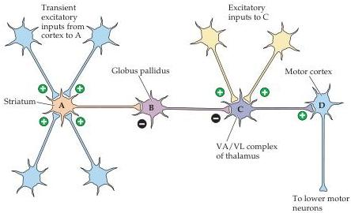
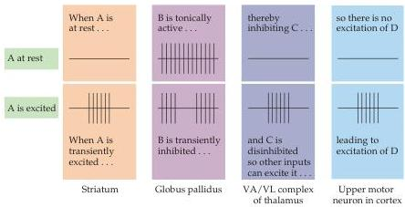

Chapter Seventeen

Figure 17.6 A chain of nerve cells arranged in a disinhibitory circuit.
Top: Diagram of the connections between two inhibitory neurons, A and B, and an excitatory neuron, C.
Bottom: Pattern of the action potential activity of cells A, B, and C when A is at rest, and when neuron A fires transiently as a result of its excitatory inputs.
Such circuits are central to the gating operations of the basal ganglia.

discharge rate of the reticulata neurons is sharply reduced by input from the GABAergic medium spiny neurons of the caudate, which have been activated by signals from the cortex.
The subsequent reduction in the tonic discharge from reticulata neurons disinhibits the upper motor neurons of the superior colliculus, allowing them to generate the bursts of action potentials that command the saccade.
Thus, the projections from substantia nigra pars reticulata to the upper motor neurons act as a physiological "gate" that must be "opened" to allow either sensory or other, more complicated, signals from cognitive centers to activate the upper motor neurons and initiate a saccade.
Upper motor neurons in the cortex are similarly gated by the basal ganglia but, as discussed earlier, the tonic inhibition is mediated mainly by the GABAergic projection from the internal division of the globus pallidus to the relay cells in the ventral lateral and anterior nuclei of the thalamus (see Figures 17.5 and 17.6).

# Circuits within the Basal Ganglia System

The projections from the medium spiny neurons of the caudate and putamen to the internal segment of the globus pallidus and substantia nigra pars