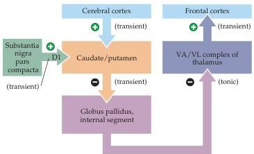
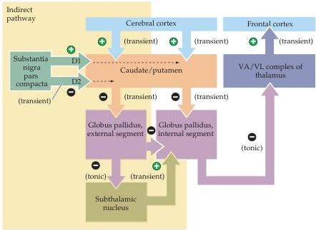

Modulation of Movement by the Basal Ganglia 427

(A) Direct pathway

(B) Indirect and direct pathways

nal globus pallidus and substantia nigra pars reticulata.
In the indirect pathway, a population of medium spiny neurons projects to the lateral or external segment of the globus pallidus.
This external division sends projections both to the internal segment of the globus pallidus and to the subthalamic nucleus of the ventral thalamus (see Figure 17.1).
But, instead of projecting to structures outside of the basal ganglia, the subthalamic nucleus projects back to the internal segment of the globus pallidus and to the substantia nigra pars reticulata.
As already described, these latter two nuclei project out of the basal ganglia, which thus allows the indirect pathway to influence the activity of the upper motor neurons.

The indirect pathway through the basal ganglia apparently serves to modulate the disinhibitory actions of the direct pathway.
The subthalamic nucleus neurons that project to the internal globus pallidus and substantia

Figure 17.8 Disinhibition in the direct and indirect pathways through the basal ganglia.
(A) In the direct pathway, transiently inhibitory projections from the caudate and putamen project to tonically active inhibitory neurons in the internal segment of the globus pallidus, which project in turn to the VA/VL complex of the thalamus.
Transiently excitatory inputs to the caudate and putamen from the cortex and substantia nigra are also shown, as is the transiently excitatory input from the thalamus back to the cortex.
(B) In the indirect pathway (shaded yellow), transiently active inhibitory neurons from the caudate and putamen project to tonically active inhibitory neurons of the external segment of the globus pallidus.
Note that the influence of nigral dopaminergic input to neurons in the indirect pathway is inhibitory.
The globus pallidus (external segment) neurons project to the subthalamic nucleus, which also receives a strong excitatory input from the cortex.
The subthalamic nucleus in turn projects to the globus pallidus (internal segment), where its transiently excitatory drive acts to oppose the disinhibitory action of the direct pathway.
In this way, the indirect pathway modulates the effects of the direct pathway.

