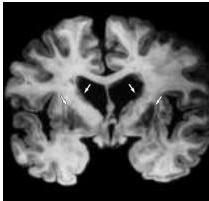
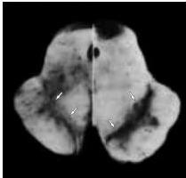

Chapter Seventeen

(A) Huntington's disease

(B) Parkinson's disease
Figure 17.9 The pathological changes in certain neurological diseases provide insights about the function of the basal ganglia.
(A) The size of the caudate and putamen (the striatum) (arrows) is dramatically reduced in patients with Huntington's disease.
(B) Left: The midbrain from a patient with Parkinson's disease.
The substantia nigra (pigmented area) is largely absent in the region above the cerebral peduncles (arrows).
Right: The mesencephalon from a normal subject, showing intact substantia nigra (arrows).
(From Bradley et al., 1991.)

nigra pars reticulata are excitatory.
Normally, when the indirect pathway is activated by signals from the cortex, the medium spiny neurons discharge and inhibit the tonically active GABAergic neurons of the external globus pallidus.
As a result, the subthalamic cells become more active and, by virtue of their excitatory synapses with cells of the internal globus pallidus and reticulata, they increase the inhibitory outflow of the basal ganglia.
Thus, in contrast to the direct pathway, which when activated reduces tonic inhibition, the net effect of activity in the indirect pathway is to increase inhibitory influences on the upper motor neurons.
The indirect pathway can thus be regarded as a "brake" on the normal function of the direct pathway.
Indeed, many neural systems achieve fine control of their output by a similar interplay between excitation and inhibition.

The consequences of imbalances in this fine control mechanism are apparent in diseases that affect the subthalamic nucleus.
These disorders remove a source of excitatory input to the internal globus pallidus and reticulata, and thus abnormally reduce the inhibitory outflow of the basal ganglia.
A basal ganglia syndrome called hemiballismus, which is characterized by violent, involuntary movements of the limbs, is the result of damage to the subthalamic nucleus.
The involuntary movements are initiated by abnormal discharges of upper motor neurons that are receiving less tonic inhibition from the basal ganglia.

Another circuit within the basal ganglia system entails the dopaminergic cells in the pars compacta subdivision of substantia nigra and modulates the output of the corpus striatum.
The medium spiny neurons of the corpus striatum project directly to substantia nigra pars compacta, which in turn sends widespread dopaminergic projections back to the spiny neurons.
These dopaminergic influences on the spiny neurons are complex: The same nigral neurons can provide excitatory inputs mediated by D1 type dopaminergic receptors on the spiny cells that project to the internal globus pallidus (the direct pathway), and inhibitory inputs mediated by D2 type receptors on the spiny cells that project to the external globus pallidus (the indirect pathway).
Since the actions of the direct and indirect pathways on the output of the basal ganglia are antagonistic, these different influences of the nigrostriatal axons produce the same effect, namely a decrease in the inhibitory outflow of the basal ganglia.

The modulatory influences of this second internal circuit help explain many of the manifestations of basal ganglia disorders.
For example, Parkinson's disease is caused by the loss of the nigrostriatal dopaminergic neurons (Figure 17.9B and Box B).
As mentioned earlier, the normal effects of the compacta input to the striatum are excitation of the medium spiny neurons that project directly to the internal globus pallidus and inhibition of the spiny neurons that project to the external globus pallidus cells in the indirect pathway.
Normally, both of these dopaminergic effects serve to decrease the inhibitory outflow of the basal ganglia and thus to increase the excitability of the upper motor neurons (Figure 17.10A).
In contrast, when the compacta cells are destroyed, as occurs in Parkinson's disease, the inhibitory outflow of the basal ganglia is abnormally high, and thalamic activation of upper motor neurons in the motor cortex is therefore less likely to occur.

In fact, many of the symptoms seen in Parkinson's disease (and in other hypokinetic movement disorders) reflect a failure of the disinhibition normally mediated by the basal ganglia.
Thus, Parkinsonian patients tend to have diminished facial expressions and lack "associated movements" such as arm swinging during walking.
Indeed, any movement is difficult to initiate and, once initiated, is often difficult to terminate.
Disruption of the same