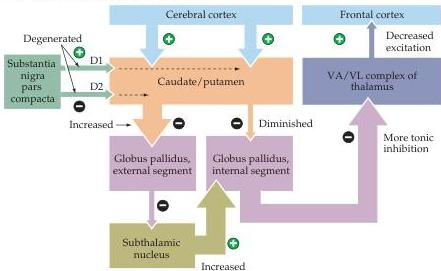
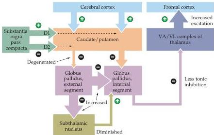

Chapter Seventeen

circuits also increases the discharge rate of the inhibitory cells in substantia nigra pars reticulata.
The resulting increase in tonic inhibition reduces the excitability of the upper motor neurons in the superior colliculus and causes saccades to be reduced in both frequency and amplitude.

Support for this explanation of hypokinetic movement disorders like Parkinson's disease comes from studies of monkeys in which degeneration of the dopaminergic cells of substantia nigra has been induced by the neurotoxin 1-methyl-4-phenyl-1,2,3,6-tetrahydropyridine (MPTP).
Monkeys (or humans) exposed to MPTP develop symptoms that are very similar to those of patients with Parkinson's disease.
Furthermore, a second lesion placed in the subthalamic nucleus results in significant improvement in the ability of these animals to initiate movements, as would be expected based on the circuitry of the indirect pathway (see Figure 17.8B).

Figure 17.10 Summary explanation of hypokinetic disorders such as Parkinson's disease and hyperkinetic disorders like Huntington's disease.
In both cases, the balance of inhibitory signals in the direct and indirect pathways is altered, leading to a diminished ability of the basal ganglia to control the thalamic output to the cortex.
(A) In Parkinson's disease, the inputs provided by the substantia nigra are diminished (thinner arrow), making it more difficult to generate the transient inhibition from the caudate and putamen.
The result of this change in the direct pathway is to sustain the tonic inhibition from the globus pallidus (internal segment) to the thalamus, making thalamic excitation of the motor cortex less likely (thinner arrow from thalamus to cortex).
(B) In hyperkinetic diseases such as Huntington's, the projection from the caudate and putamen to the globus pallidus (external segment) is diminished (thinner arrow).
This effect increases the tonic inhibition from the globus pallidus to the subthalamic nucleus (larger arrow), making the excitatory subthalamic nucleus less effective in opposing the action of the direct pathway (thinner arrow).
Thus, thalamic excitation of the cortex is increased (larger arrow), leading to greater and often inappropriate motor activity.
(After DeLong, 1990.)

(A) Parkinson's disease (hypokinetic)

(B) Huntington's disease (hyperkinetic)