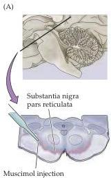
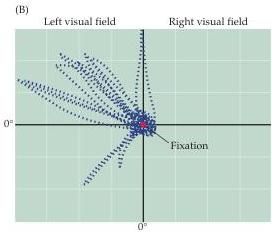

Modulation of Movement by the Basal Ganglia 431

Similarly, knowledge about the indirect pathway within the basal ganglia helps explain the motor abnormalities seen in Huntington's disease (see Box A).
In patients with Huntington's disease, medium spiny neurons that project to the external segment of the globus pallidus degenerate (see Figure 17.9A).
In the absence of their normal inhibitory input from the spiny neurons, the external globus pallidus cells become abnormally active; this activity reduces in turn the excitatory output of the subthalamic nucleus to the internal globus pallidus (Figure 17.10B).
In consequence, the inhibitory outflow of the basal ganglia is reduced.
Without the restraining influence of the basal ganglia, upper motor neurons can be activated by inappropriate signals, resulting in the undesired ballistic and choreic (dancelike) movements that characterize Huntington's disease.
Importantly, the basal ganglia may exert a similar influence on other non-motor systems with equally significant clinical implications (Box C).

As predicted by this account, GABA agonists and antagonists applied to substantia nigra pars reticulata of monkeys produce symptoms similar to those seen in human basal ganglia disease.
For example, intranigral injection of bicuculline, which blocks the GABAergic inputs from the striatal medium spiny neurons to the reticulata cells, increases the amount of tonic inhibition on the upper motor neurons in the deep collicular layers.
These animals exhibit fewer, slower saccades, reminiscent of patients with Parkinson's disease.
In contrast, injections of the GABA agonist muscimol into substantia nigra pars reticulata decrease the tonic GABAergic inhibition of the upper motor neurons in the superior colliculus, with the result that the injected monkeys generate spontaneous, irrepressible saccades that resemble the involuntary movements characteristic of basal ganglia diseases such as hemiballismus and Huntington's disease (Figure 17.11).

Figure 17.11 After the tonically active cells of substantia nigra pars reticulata are inactivated by an intranigral injection of muscimol (A), the upper motor neurons in the deep layers of the superior colliculus are disinhibited and the monkey generates spontaneous irrepressible saccades (B).
The cells in both substantia nigra pars reticulata and the deep layers of the superior colliculus are arranged in spatially organized motor maps of saccade vectors (see Chapter 19), and so the direction of the involuntary saccades—in this case toward the upper left quadrant of the visual field—depends on the precise location of the injection site in the substantia nigra.

