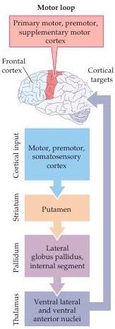
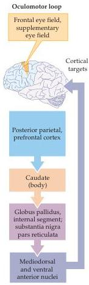
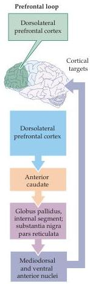
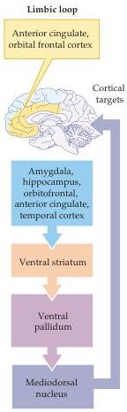

Chapter Seventeen

# Box C

## Basal Ganglia Loops and Non-Motor Brain Functions

Traditionally, the basal ganglia have been regarded as motor structures that regulate the initiation of movements.
However, the basal ganglia are also central structures in anatomical circuits or loops that are involved in modulating non-motor aspects of behavior.
These parallel loops originate in broad regions of the cortex, engage specific subdivisions of the basal ganglia and thalamus, and ultimately terminate in areas of the frontal lobe outside of the primary motor and premotor cortices.
These non-motor loops (see figure) include a "prefrontal" loop involving the dorsolateral prefrontal cortex and part of the caudate (see Chapter 25), a "limbic" loop involving the cingulate cortex and the ventral striatum (see Chapter 28), and an "oculomotor" loop that modulates the activity of the frontal eye fields (see Chapter 19).

The anatomical similarity of these loops to the traditional motor loop suggests that the non-motor regulatory functions of the basal ganglia may be generally the same as what the basal ganglia do in regulating the initiation of movement.
For example, the prefrontal loop may regulate the initiation and termination of cognitive processes such as planning, working memory, and attention.
By the same token, the limbic loop may regulate emotional behavior and motivation.
Indeed, the deterioration of cognitive and emotional function in both Huntington's disease (see Box A) and Parkinson's disease (see Box B) could be the result of disruption of these non-motor loops.

sylvius

Comparison of the motor and three non-motor basal ganglia loops.