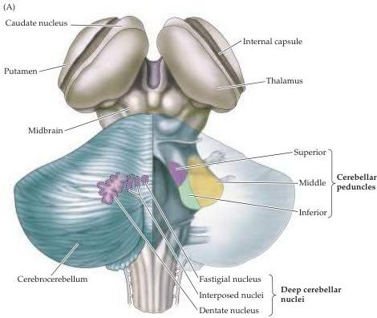
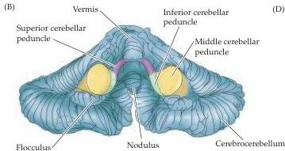
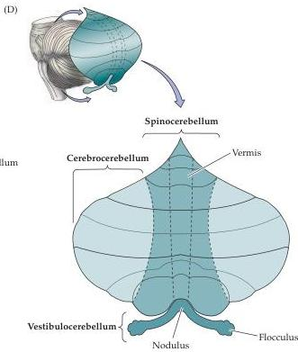
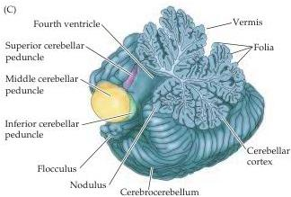

Chapter Eighteen

Figure 18.1 Overall organization and subdivisions of the cerebellum.
(A) Dorsal view of the left cerebellar hemisphere also illustrating the location of the deep cerebellar nuclei.
The right hemisphere has been removed to show the cerebellar peduncles.
(B) Removal from the brainstem reveals the cerebellar peduncles on the anterior aspect of the inferior surface.
(C) Paramedian sagittal section through the left cerebellar hemisphere showing the highly convoluted cerebellar cortex.
The small gyri in the cerebellum are called folia.
(D) Flattened view of the cerebellar surface illustrating the three major subdivisions.

