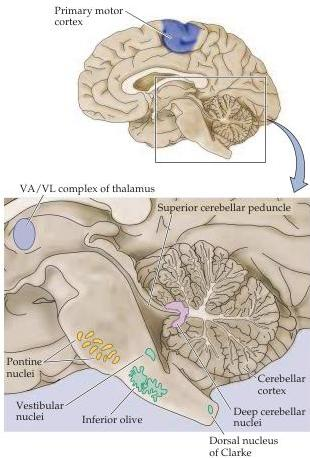

Modulation of Movement by the Cerebellum 437

the regulation of movements underlying posture and equilibrium.
The last of the major subdivisions is the spinocerebellum.
The spinocerebellum occupies the median and paramedian zone of the cerebellar hemispheres and is the only part that receives input directly from the spinal cord.
The lateral part of the spinocerebellum is primarily concerned with movements of distal muscles, such as the relatively gross movements of the limbs in walking.
The central part, called the vermis, is primarily concerned with movements of proximal muscles, and also regulates eye movements in response to vestibular inputs.

The connections between the cerebellum and other parts of the nervous system occur by way of three large pathways called cerebellar peduncles (Figures 18.1 to 18.3).
The superior cerebellar peduncle (or brachium conjunctivum) is almost entirely an efferent pathway.
The neurons that give rise to this pathway are in the deep cerebellar nuclei, and their axons project to upper motor neurons in the red nucleus, the deep layers of the superior colliculus, and, after a relay in the dorsal thalamus, the primary motor and premotor areas of the cortex (see Chapter 16).
The middle cerebellar peduncle (or brachium pontis) is an afferent pathway to the cerebellum; most of the cell bodies that give rise to this pathway are in the base of the pons, where they form the pontine nuclei (Figure 18.2).
The pontine nuclei receive input from a wide variety of sources, including almost all areas of the cerebral cortex and the superior colliculus.
The axons of the pontine nuclei, called transverse pontine fibers, cross the midline and enter the cerebellum via the

|  TABLE 18.1  |
| --- |
|  Major Components of the Cerebellum  |
|  **Cerebellar cortex**  |
|  Cerebrocerebellum  |
|  Spinocerebellum  |
|  Vestibulocerebellum  |
|  **Deep cerebellar nuclei**  |
|  Dentate nucleus  |
|  Interposed nuclei  |
|  Fastigial nucleus  |
|  **Cerebellar peduncles**  |
|  Superior peduncle  |
|  Middle peduncle  |
|  Inferior peduncle  |

Figure 18.2 Components of the brainstem and diencephalon related to the cerebellum.
This sagittal section shows the major structures of the cerebellar system, including the cerebellar cortex, the deep cerebellar nuclei, and the ventroanterior and ventrolateral (VA/VL) complex (which is the target of some of the deep cerebellar nuclei).