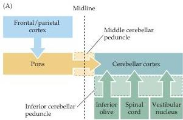
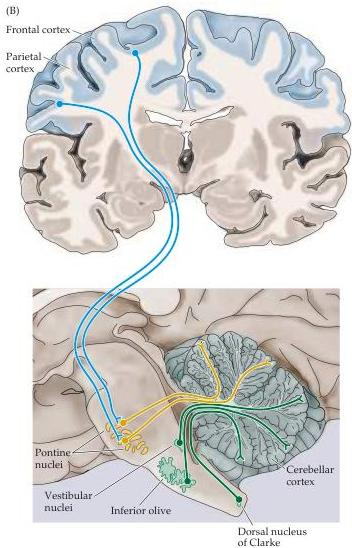

Chapter Eighteen

Figure 18.3 Functional organization of the inputs to the cerebellum.
(A) Diagram of the major inputs.
(B) Idealized coronal and sagittal sections through the human brainstem and cerebrum, showing inputs to the cerebellum from the cortex, vestibular system, spinal cord, and brainstem.
The cortical projections to the cerebellum are made via relay neurons in the pons.
These pontine axons then cross the midline within the pons and run to the cerebellum via the middle cerebellar peduncle.
Axons from the inferior olive, spinal cord, and vestibular nuclei enter via the inferior cerebellar peduncle.

TABLE 18.2 Major inputs to the Cerebellum (via Inferior and Middle Cerebellar Peduncles)

|  From cerebral cortex: Parietal cortex (secondary visual, primary and secondary somatic sensory) Cingulate cortex (limbic) Frontal cortex (primary and secondary motor)  |
| --- |
|  Other sources: Red nucleus Superior colliculus Spinal cord (Clarke's column) Vestibular labyrinth and nuclei Reticular formation Inferior olivary nucleus Locus ceruleus  |

middle cerebellar peduncle (Figure 18.3).
Each of the two middle cerebellar peduncles contain over 20 million axons, making this one of the largest pathways in the brain.
In comparison, the optic and pyramidal tracts contain only about a million axons.
Most of these pontine axons relay information from the cortex to the cerebellum.
Finally, the inferior cerebellar peduncle (or restiform body) is the smallest but most complex of the cerebellar peduncles, containing multiple afferent and efferent pathways.
Efferent pathways in this peduncle project to the vestibular nuclei and the reticular formation; the afferent pathways include axons from the vestibular nuclei, the spinal cord, and several regions of the brainstem tegmentum.

# Projections to the Cerebellum

The cerebral cortex is by far the largest source of inputs to the cerebellum, and the major destination of these inputs is the cerebrocerebellum (see Figure 18.3 and Table 18.2).
These pathways arise from a somewhat more circumscribed area of the cortex than do those to the basal ganglia (see Chapter 17).
The majority originate in the primary motor and premotor cortices of