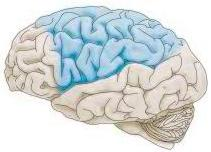
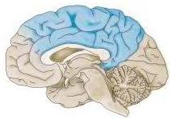
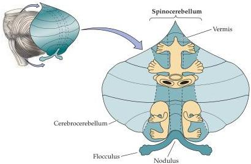

Modulation of Movement by the Cerebellum 439

Figure 18.4 Regions of the cerebral cortex that project to the cerebellum (shown in blue).
The cortical projections to the cerebellum are mainly from the sensory association cortex of the parietal lobe and motor association areas of the frontal lobe.

the frontal lobe, the primary and secondary somatic sensory cortices of the anterior parietal lobe, and the secondary visual regions of the posterior parietal lobe (Figure 18.4).
The visual input to the cerebellum originates mostly in association areas concerned with processing moving visual stimuli (i.e., the cortical targets of the magnocellular stream; see Chapter 11).
Indeed, visually guided coordination of ongoing movement is one of the major tasks carried out by the cerebrocerebellum.
Most of these cortical pathways relay in the pontine nuclei before entering the cerebellum (see Figure 18.3).

Sensory pathways also project to the cerebellum (see Figure 18.3 and Table 18.2).
Vestibular axons from the eighth cranial nerve and axons from the vestibular nuclei in the medulla project to the vestibulocerebellum.
In addition, relay neurons in the dorsal nucleus of Clarke in the spinal cord (a group of relay neurons innervated by proprioceptive axons from the periphery; see Chapter 8) send their axons to the spinocerebellum.
The vestibular and spinal inputs provide the cerebellum with information from the labyrinth in the ear, from muscle spindles, and from other mechanoreceptors that monitor the position and motion of the body.
The somatic sensory input remains topographically mapped in the spinocerebellum such that there are orderly representations of the body surface within the cerebellum (Figure 18.5).
These maps are "fractured," however: That is, fine-grain electrophysiological analysis indicates that each small area of the body surface is represented multiple times by spatially separated clusters of cells rather than by a specific site within a single continuous topographic map of the body surface.
The vestibular and spinal inputs remain ipsilateral from their point of entry

Figure 18.5 Somatotopic maps of the body surface in the cerebellum.
The spinocerebellum contains at least two maps of the body.