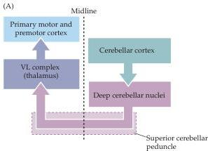
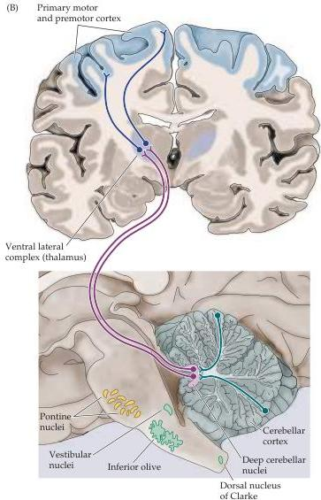

Chapter Eighteen

in the brainstem, traveling in the inferior cerebellar peduncle (see Figure 18.3B).
This arrangement ensures that, in contrast to most areas of the brain, the right cerebellum is concerned with the right half of the body and the left cerebellum with the left half.

Finally, the entire cerebellum receives modulatory inputs from the inferior olive and the locus ceruleus in the brainstem.
These nuclei evidently participate in the learning and memory functions served by cerebellar circuitry.

## Projections from the Cerebellum

Except for a direct projection from the vestibulocerebellum to the vestibular nuclei, the cerebellar cortex projects to the deep cerebellar nuclei, which project in turn to upper motor neurons in the cortex (via a relay in the thalamus) and in the brainstem (Figure 18.6 and Table 18.3).
There are four major deep

Figure 18.6 Functional organization of the outputs from the cerebellum to the cerebral cortex.
(A) Targets of the cerebellum.
The axons of the deep cerebellar nuclei cross in the midbrain in the decussation of the superior cerebellar peduncle before reaching the thalamus.
(B) Idealized coronal and sagittal sections through the human brainstem and cerebrum, showing the location of the structures and pathways diagrammed in (A).

