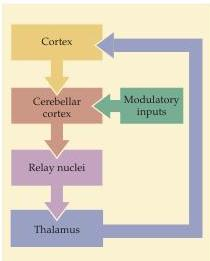

Modulation of Movement by the Cerebellum 441

nuclei: the dentate nucleus (by far the largest), two interposed nuclei, and the fastigial nucleus.
Each receives input from a different region of the cerebellar cortex.
Although the borders are not distinct, in general, the cerebro-cerebellum projects primarily to the dentate nucleus, the spinocerebellum to the interposed nuclei, and the vestibulocerebellum to the fastigial nucleus.
Pathways from the dentate nucleus are destined for the cortex via a relay in the ventral nuclear complex in the thalamus.
Since each cerebellar hemisphere is concerned with the ispsilateral side of the body, this pathway must cross the midline if the motor cortex in each hemisphere, which is concerned with contralateral musculature, is to receive information from the appropriate cerebellum.
Consequently, the dentate axons exit the cerebellum via the superior cerebellar peduncle, cross at the decussation of the superior cerebellar peduncle in the caudal midbrain, and then ascend to the thalamus.

The thalamic nuclei that receive projections from the deep cerebellar nuclei are segregated in two distinct subdivisions of the ventral lateral nuclear complex: the oral, or anterior, part of the posterolateral segment, and a region simply called "area X." Both of these thalamic relays project directly to primary motor and premotor association cortices.
Thus, the cerebellum has access to the upper motor neurons that organize the sequence of muscular contractions underlying complex voluntary movements (see Chapter 16).
Pathways leaving the deep cerebellar nuclei also project to upper motor neurons in the red nucleus, the superior colliculus, the vestibular nuclei, and the reticular formation (see Table 18.3 and Chapter 16).

Anatomical studies using viruses to trace chains of connections between nerve cells have shown that large parts of the cerebrocerebellum send information back to non-motor areas of the cortex to form "closed loops." That is, a region of the cerebellum projects back to the same cortical area that in turn projects to it.
These closed loops run in parallel to "open loops" that receive input from multiple cortical areas and funnel output back to upper motor neurons in specific regions of the motor and premotor cortices (Figure 18.7).

# Circuits within the Cerebellum

The ultimate destination of the afferent pathways to the cerebellar cortex is a distinctive cell type called the Purkinje cell (Figure 18.8).
However, the input from the cerebral cortex to the Purkinje cells is indirect.
Neurons in the pontine nuclei receive a projection from the cerebral cortex and then relay the information to the contralateral cerebellar cortex.
The axons from the pontine nuclei and other sources are called mossy fibers because of the appearance of their synaptic terminals.
Mossy fibers synapse on granule cells in the granule cell layer of the cerebellar cortex (see Figures 18.8 and 18.9).
The cerebellar granule cells are widely held to be the most abundant class of neurons in the human brain.
They give rise to specialized axons called parallel fibers that ascend to the molecular layer of the cerebellar cortex.
The parallel fibers bifurcate in the molecular layer to form T-shaped branches that relay information via excitatory synapses onto the dendritic spines of the Purkinje cells.

The Purkinje cells present the most striking histological feature of the cerebellum.
Elaborate dendrites extend into the molecular layer from a single subjacent layer of these giant nerve cell bodies (called the Purkinje layer).
Once in the molecular layer, the Purkinje cell dendrites branch extensively in a plane at right angles to the trajectory of the parallel fibers (Figure 18.8A).
In this way, each Purkinje cell is in a position to receive input from a large number of parallel fibers, and each parallel fiber can contact a very large

|  TABLE 18.3  |
| --- |
|  Output Targets of the Cerebellum  |
|  Red nucleus  |
|  Vestibular nuclei  |
|  Superior colliculus  |
|  Reticular formation  |
|  Motor cortex (via relay in ventral lateral nuclei of thalamus)  |

Figure 18.7 Summary diagram of motor modulation by the cerebrocerebellum.
The central processing component, the cerebrocerebellar cortex, receives massive input from the cerebral cortex and generates signals that adjust the responses of upper motor neurons to regulate the course of a movement.
Note that modulatory inputs also influence the processing of information within the cerebellar cortex.
The output signals from the cerebellar cortex are relayed indirectly to the thalamus and then back to the motor cortex, where they modulate the motor commands.