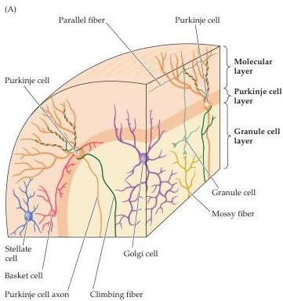
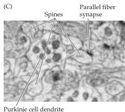
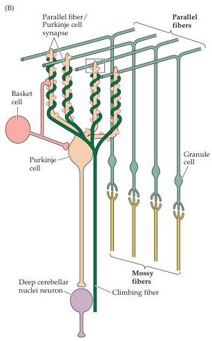

Chapter Eighteen

Figure 18.8 Neurons and circuits of the cerebellum.
(A) Neuronal types in the cerebellar cortex.
Note that the various neuron classes are found in distinct layers.
(B) Diagram showing convergent inputs onto the Purkinje cell from parallel fibers and local circuit neurons [boxed region shown at higher magnification in (C)].
The output of the Purkinje cells is to the deep cerebellar nuclei.
(C) Electron micrograph showing Purkinje cell dendritic shaft with three spines contacted by synapses from a trio of parallel fibers.
(C courtesy of A.
S.
La Mantia and P.
Rakic.)

number of Purkinje cells (on the order of tens of thousands).
The Purkinje cells also receive a direct modulatory input on their dendritic shafts from the climbing fibers, all of which arise in the inferior olive (Figure 18.8B).
Each Purkinje cell receives numerous synaptic contacts from a single climbing fiber.
In most models of cerebellum function, the climbing fibers regulate movement by modulating the effectiveness of the mossy-parallel fiber connection with the Purkinje cells.

The Purkinje cells project in turn to the deep cerebellar nuclei.
They are the only output cells of the cerebellar cortex.
Since Purkinje cells are GABAergic, the output of the cerebellar cortex is wholly inhibitory.
However, the neurons in the deep cerebellar nuclei receive excitatory input from the collaterals of the mossy and climbing fibers.
The Purkinje cell inhibition of the deep nuclei neurons serves to modulate the level of this excitation (Figure 18.9).

Inputs from local circuit neurons modulate the inhibitory activity of Purkinje cells and occur on both dendritic shafts and the cell body.
The most powerful of these local inputs are inhibitory complexes of synapses made around the Purkinje cell bodies by basket cells (see Figure 18.8A,B).
Another type of local circuit neuron, the stellate cell, receives input from the parallel fibers and provides an inhibitory input to the Purkinje cell dendrites.
Finally,