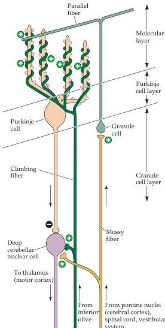

Modulation of Movement by the Cerebellum 443

the molecular layer contains the apical dendrites of a cell type called Golgi cells; these neurons have their cell bodies in the granular cell layer.
The Golgi cells receive input from the parallel fibers and provide an inhibitory feedback to the cells of origin of the parallel fibers (the granule cells).

This basic circuit is repeated over and over throughout every subdivision of the cerebellum in all mammals and is the fundamental functional module of the cerebellum.
Modulation of signal flow through these modules provides the basis for both real-time regulation of movement and the long-term changes in regulation that underlie motor learning.
The flow of signals through this admittedly complex intrinsic circuitry is best described in reference to the Purkinje cells (see Figure 18.9).
The Purkinje cells receive two types of excitatory input from outside of the cerebellum, one directly from the climbing fibers and the other indirectly via the parallel fibers of the granule cells.
The Golgi, stellate, and basket cells control the flow of information through the cerebellar cortex.
For example, the Golgi cells form an inhibitory feedback that may limit the duration of the granule cell input to the Purkinje cells, whereas the basket cells provide lateral inhibition that may focus the

Figure 18.9 Excitatory and inhibitory connections in the cerebellar cortex and deep cerebellar nuclei.
The excitatory input from mossy fibers and climbing fibers to Purkinje cells and deep nuclear cells is basically the same.
Additional convergent input onto the Purkinje cell from local circuit neurons (basket and stellate cells) and other Purkinje cells establishes a basis for the comparison of ongoing movement and sensory feedback derived from it.
The Purkinje cell output to the deep cerebellar nuclear cell thus generates an error correction signal that can modify movements already begun.
The climbing fibers modify the efficacy of the parallel fiber-Purkinje cell connection, producing long-term changes in cerebellar output.
(After Stein, 1986.)