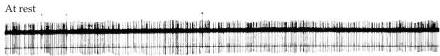
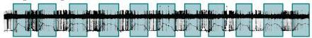
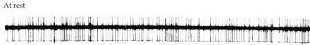
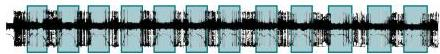

Chapter Eighteen

Figure 18.10 Activity of Purkinje cells (A) and deep cerebellar nuclear cells (B) at rest (upper traces) and during movement of the wrist (lower traces).
The lines below the action potential records show changes in muscle tension, recorded by electromyography.
The durations of the wrist movements are indicated by the colored blocks.
Both classes of cells are tonically active at rest.
Rapid alternating movements result in the transient inhibition of the tonic activity of both cell types.
(After Thach, 1968.)

(A) PURKINJE CELL

(B) DEEP NUCLEAR CELL

During alternating movement

ments are modified to cope with changing circumstances.
As described earlier, the Purkinje cells and the deep cerebellar nuclear cells recognize potential errors by comparing patterns of convergent activity that are concurrently available to both cell types; the deep nuclear cells then send corrective signals to the upper motor neurons in order to maintain or improve the accuracy of the movement.

As in the case of the basal ganglia, studies of the oculomotor system (saccades in particular) have contributed greatly to understanding the contribution that the cerebellum makes to motor error reduction.
For example, cutting part of the tendon to the lateral rectus muscles in one eye of a monkey weakens horizontal eye movements by that eye (Figure 18.11).
When a patch is then placed over the normal eye to force the animal to use its weak eye, the saccades performed by the weak eye are initially hypometric; as expected, they fall short of visual targets.
Then, over the next few days, the amplitude of the saccades gradually increases until they again become accurate.
If the patch is then switched to cover the weakened eye, the saccades performed by the normal eye are now hypermetric.
In other words, over a period of a few days the nervous system corrects the error in the saccades made by the weak eye by increasing the gain in the saccade motor system.
Lesions in the vermis of the spinocerebellum (see Figure 18.1) eliminate this ability to reduce the motor error.

Similar evidence of the cerebellar contribution to movement has come from studies of the vestibulo-ocular reflex (VOR) in monkeys and humans.
The VOR works to keep the eyes trained on a visual target during head movements (see Chapter 13).
The relative simplicity of this reflex has made it possible to analyze some of the mechanisms that enable motor learning as a process of error reduction.
When a visual image on the retina shifts its position as a result of head movement, the eyes must move at the same velocity in the opposite direction to maintain a stable percept.
In these studies, the