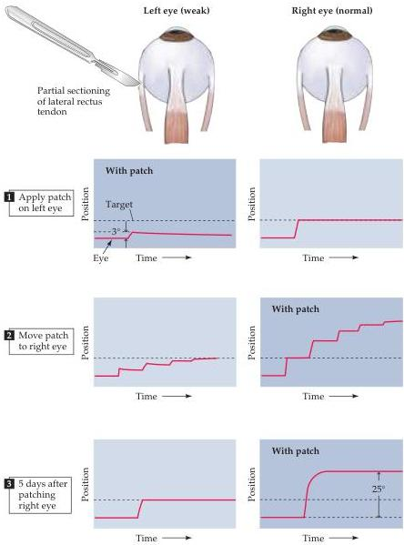

Modulation of Movement by the Cerebellum 447

adaptability of the VOR to changes in the nature of incoming sensory information is challenged by fitting subjects (either monkeys or humans) with magnifying or minifying spectacles (Figure 18.12).
Because the glasses alter the size of the visual image on the retina, the compensatory eye movements, which would normally have maintained a stable image of an object on the retina, are either too large or too small.
Over time, subjects (whether monkeys or humans) learn to adjust the distance the eyes must move in response to head movements to accord with the artificially altered size of the visual field.
Moreover, this change is retained for significant periods after the spectacles are removed and can be detected electrophysiologically in recordings from cerebellar Purkinje cells and neurons in the deep cerebellar nuclei.
Information that reflects this change in the sensory context of the VOR must therefore be learned and remembered to eliminate the artificially introduced