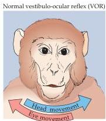
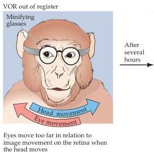
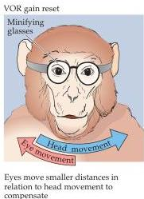

Chapter Eighteen

Head and eyes move in a coordinated manner to keep image on retina

Figure 18.12 Learned changes in the vestibulo-ocular reflex in monkeys.
Normally, this reflex operates to move the eyes as the head moves, so that the retinal image remains stable.
When the animal observes the world through minifying spectacles, the eyes initially move too far with respect to the "slippage" of the visual image on the retina.
After some practice, however, the VOR is reset and the eyes move an appropriate distance in relation to head movement, thus compensating for the altered size of the visual image.

error.
Once again, if the cerebellum is damaged or removed, the ability of the VOR to adapt to the new conditions is lost.
These observations support the conclusion that the cerebellum is critically important in error reduction during motor learning.

Cerebellar circuitry also provides real-time error correction during ongoing movements.
This function is accomplished by changes in the tonically inhibitory activity of Purkinje cells that in turn influence the tonically excitatory deep cerebellar nuclear cells.
The resulting effects on the ongoing activity of the deep cerebellar nuclear cells adjust the cerebellar output signals to the upper motor neurons in the cortex and brainstem.

# Further Consequences of Cerebellar Lesions

As mentioned in the preceding discussion, patients with cerebellar damage, regardless of the causes or location, exhibit persistent errors in movement.
These movement errors are always on the same side of the body as the damage to the cerebellum, reflecting the cerebellum's unusual status as a brain structure in which sensory and motor information is represented ipsilaterally rather than contralaterally.
Furthermore, somatic, visual, and other inputs are represented topographically within the cerebellum; as a result, the movement deficits may be quite specific.
For example, one of the most common cerebellar syndromes is caused by degeneration in the anterior portion of the cerebellar cortex in patients with a long history of alcohol abuse (Figure 18.13).
Such damage specifically affects movement in the lower limbs, which are represented in the anterior spinocerebellum (see Figure 18.5).
The consequences include a wide and staggering gait, with little impairment of arm or hand movements.
Thus, the topographical organization of the cere