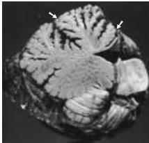

Modulation of Movement by the Cerebellum 449

bellum allows cerebellar damage to disrupt the coordination of movements performed by some muscle groups but not others.

The implication of these pathologies is that the cerebellum is normally capable of integrating the moment-to-moment actions of muscles and joints throughout the body to ensure the smooth execution of a full range of motor behaviors.
Thus, cerebellar lesions lead first and foremost to a lack of coordination of ongoing movements (Box B).
For example, damage to the vestibulocerebellum impairs the ability to stand upright and maintain the direction of gaze.
The eyes have difficulty maintaining fixation; they drift from the target and then jump back with a corrective saccade, a phenomenon called nystagmus.
Disruption of the pathways to the vestibular nuclei may also result in a loss of muscle tone.
In contrast, patients with damage to the spinocerebellum have difficulty controlling walking movements; they have a wide-based gait with small shuffling movements, which represents the inappropriate operation of groups of muscles that normally rely on sensory feedback to produce smooth, concerted actions.
The patients also have difficulty performing rapid alternating movements such as the heel-to-shin and/or finger-to-nose tests, a sign referred to as dysdiadochokinesia.
Over- and underreaching may also occur (called dysmetria).
During the movement, tremors—called action or intention tremors—accompany over- and undershooting of the movement due to disruption of the mechanism for detecting and correcting movement errors.
Finally, lesions of the cerebro-cerebellum produce impairments in highly skilled sequences of learned movements, such as speech or playing a musical instrument.
The common denominator of all of these signs, regardless of the site of the lesion, is the inability to perform smooth, directed movements.

## Summary

The cerebellum receives input from regions of the cerebral cortex that plan and initiate complex and highly skilled movements; it also receives innervation from sensory systems that monitor the course of movements.
This arrangement enables a comparison of an intended movement with the actual movement and a reduction in the difference, or "motor error." The corrections of motor error produced by the cerebellum occur both in real time and over longer periods, as motor learning.
For example, the vestibulo-ocular reflex allows an observer to fixate an object of interest while the head moves; however, lenses that change image size produce a long-term change in the gain of this reflex that depends on an intact cerebellum.
Knowledge of cerebellar circuitry suggests that motor learning is mediated by climbing fibers that ascend from the inferior olive to contact the dendrites of the Purkinje cells in the cerebellar cortex.
Information provided by the climbing fibers modulates the effectiveness of the second major input to the Purkinje cells, which arrives via the parallel fibers from the granule cells.
The granule cells receive information about the intended movement from the vast number of mossy fibers that enter the cerebellum from multiple sources, including the cortico-ponto-cerebellar pathway.
As might be expected, the output of the cerebellum from the deep cerebellar nuclei projects to all the major sources of upper motor neurons described in Chapter 16.
The effects of cerebellar disease provide strong support for the idea that the cerebellum regulates the performance of movements.
Thus, patients with cerebellar disorders show severe ataxias in which the site of the lesion determines the particular movements affected.

Figure 18.13 The pathological changes in a variety of neurological diseases provide insights about the function of the cerebellum.
In this example, chronic alcohol abuse has caused degeneration of the anterior cerebellum (arrows), while leaving other cerebellar regions intact.
The patient had difficulty walking but little impairment of arm movements or speech.
The orientation of this paramedian sagittal section is the same as Figure 18.1C.
(From Victor et al., 1959.)