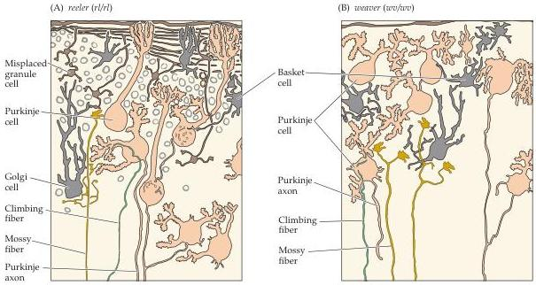

Modulation of Movement by the Cerebellum 451

some as the original reeler mutation.
Further analysis showed that the same gene had indeed been mutated, and the reeler gene was subsequently identified.
Remarkably, the protein encoded by this gene is homologous to known extracellular matrix proteins such as tenascin, laminin, and fibronectin (see Chapter 21).
This finding makes good sense, since the pathophysiology of the reeler mutation entails altered cell migration, resulting in misplaced neurons in the cerebellar cortex as well as the cerebral cortex and hippocampus.

Molecular genetic techniques have also led to cloning the weaver gene.
Using linkage analysis and the ability to clone and sequence large pieces of mammalian chromosomes, Andy Peterson and his colleagues "walked" (i.e., sequentially cloned) several kilobases of DNA in the chromosomal region to find where the weaver gene mapped.
By comparing normal and mutant sequences within this region, they determined weaver to be a mutation in a $\mathrm{K}^{+}$ channel that resembles the $\mathrm{Ca^{2+}}$-activated $\mathrm{K}^{+}$ channels found in cardiac muscle.
How this particular molecule influences the development of granule cells or causes their death in the mutants is not yet clear.

The story of the proteins encoded by the reeler and weaver genes indicates both the promise and the challenge of a genetic approach to understanding cerebellar function.
Identifying motor mutants and their pathology is reasonably straightforward, but understanding their molecular genetic basis depends on hard work and good luck.

## References

CAVINESS, V.
S.
JR.
AND P.
RAKIC (1978) Mechanisms of cortical development: A view from mutations in mice.
Annu.
Rev.
Neurosci.
1: 297-326.
D'ARCANGELO, G., G.
G.
MIAO, S.
C.
CHEN, H.
D.
SOARES, J.
I.
MORGAN AND T.
CURRAN (1995) A protein related to extracellular matrix proteins deleted in the mouse mutation reeler.
Nature 374: 719-723.
PATIL, N., D.
R.
COX, D.
BHAT, M.
FAHAM, R.
M.
MEYERS AND A.
PETERSON (1995) A potassium channel mutation in weaver mice implicates membrane excitability in granule cell differentiation.
Nature Genetics 11: 126-129.
RAKIC, P.
AND V.
S.
CAVINESS JR.
(1995) Cortical development: A view from neurological mutants two decades later.
Neuron 14: 1101-1104.

The cerebellar cortex is disrupted in both the reeler and weaver mutations.
(A) The cerebellar cortex in homozygous reeler mice.
The reeler mutation causes the major cell types of the cerebellar cortex to be displaced from their normal laminar positions.
Despite the disorganization of the cerebellar cortex in reeler mutants, the major inputs—mossy fibers and climbing fibers—find appropriate targets.
(B) The cerebellar cortex in homozygous weaver mice.
The granule cells are missing, and the major cerebellar inputs synapse inappropriately on the remaining neurons.
(After Rakic, 1977.)

