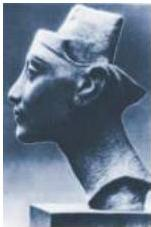
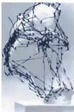

Chapter Nineteen

Figure 19.1 The eye movements of a subject viewing a picture of Queen Nefertiti.
The bust at the top is what the subject saw; the diagram on the bottom shows the subject's eye movements over a 2-minute viewing period.
(From Yarbus, 1967.)

information.
As is apparent in Figure 19.1, tracking eye movements can be used to determine what aspects of a scene are particularly arresting.
Advertisers now use modern versions of Yarbus' method to determine which pictures and scene arrangements will best sell their product.

The importance of eye movements for visual perception has also been demonstrated by experiments in which a visual image is stabilized on the retina, either by paralyzing the extraocular eye muscles or by moving a scene in exact register with eye movements so that the different features of the image always fall on exactly the same parts of the retina (Box A).
Stabilized visual images rapidly disappear, for reasons that remain poorly understood.
Nonetheless, these observations on motionless images make it plain that eye movements are also essential for normal visual perception.

## The Actions and Innervation of Extraocular Muscles

Three antagonistic pairs of muscles control eye movements: the lateral and medial rectus muscles, the superior and inferior rectus muscles, and the superior and inferior oblique muscles.
These muscles are responsible for movements of the eye along three different axes: horizontal, either toward the nose (adduction) or away from the nose (abduction); vertical, either elevation or depression; and torsional, movements that bring the top of the eye toward the nose (intorsion) or away from the nose (extorsion).
Horizontal movements are controlled entirely by the medial and lateral rectus muscles; the medial rectus muscle is responsible for adduction, the lateral rectus muscle for abduction.
Vertical movements require the coordinated action of the superior and inferior rectus muscles, as well as the oblique muscles.
The relative contribution of the rectus and oblique groups depends on the horizontal position of the eye (Figure 19.2).
In the primary position (eyes straight ahead), both of these groups contribute to vertical movements.
Elevation is due to the action of the superior rectus and inferior oblique muscles, while depression is due to the action of the inferior rectus and superior oblique muscles.
When the eye is abducted, the rectus muscles are the prime vertical movers.
Elevation is due to the action of the superior rectus, and depression is due to the action of the inferior rectus.
When the eye is adducted, the oblique muscles are the prime vertical movers.
Elevation is due to the action of the inferior oblique muscle, while depression is due to the action of the superior oblique muscle.
The oblique muscles are also primarily responsible for torsional movements.

The extraocular muscles are innervated by lower motor neurons that form three cranial nerves: the abducens, the trochlear, and the oculomotor (Figure 19.3).
The abducens nerve (cranial nerve VI) exits the brainstem from the pons-medullary junction and innervates the lateral rectus muscle.
The trochlear nerve (cranial nerve IV) exits from the caudal portion of the midbrain and supplies the superior oblique muscle.
In distinction to all other cranial nerves, the trochlear nerve exits from the dorsal surface of the brainstem and crosses the midline to innervate the superior oblique muscle on the contralateral side.
The oculomotor nerve (cranial nerve III), which exits from the rostral midbrain near the cerebral peduncle, supplies all the rest of the extraocular muscles.
Although the oculomotor nerve governs several different muscles, each receives its innervation from a separate group of lower motor neurons within the third nerve nucleus.

In addition to supplying the extraocular muscles, a distinct cell group within the oculomotor nucleus innervates the levator muscles of the eyelid; the axons from these neurons also travel in the third nerve.
Finally, the third