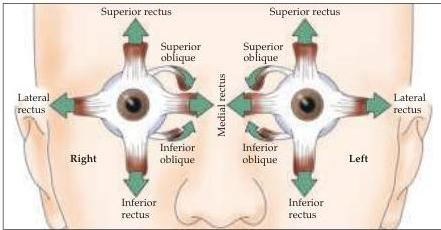
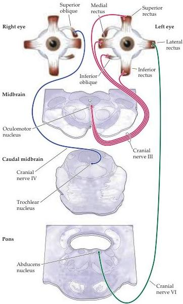

Figure 19.2 The contributions of the six extraocular muscles to vertical and horizontal eye movements.
Horizontal movements are mediated by the medial and lateral rectus muscles, while vertical movements are mediated by the superior and inferior rectus and the superior and inferior oblique muscle groups.

Figure 19.3 Organization of the cranial nerve nuclei that govern eye movements, showing their innervation of the extraocular muscles.
The abducens nucleus innervates the lateral rectus muscle; the trochlear nucleus innervates the superior oblique muscle; and the oculomotor nucleus innervates all the rest of the extraocular muscles (the medial rectus, inferior rectus, superior rectus, and inferior oblique).

# sylvius