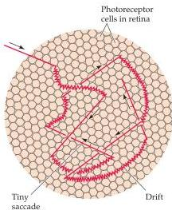
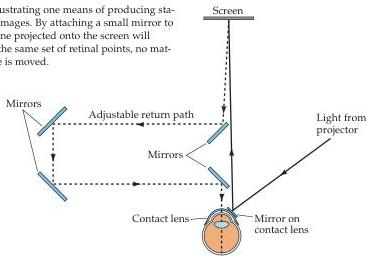

Chapter Nineteen

# Box A

## The Perception of Stabilized Retinal Images

Visual perception depends critically on frequent changes of scene.
Normally, our view of the world is changed by saccades, and tiny saccades that continue to move the eyes abruptly over a fraction of a degree of visual arc occur even when the observer stares intently at an object of interest.
Moreover, continual drift of the eyes during fixation progressively shifts the image onto a nearby but different set of photoreceptors.
As a consequence of these several sorts of eye movements (Figure A), our point of view changes more or less continually.

The importance of a continually changing scene for normal vision is dramatically revealed when the retinal image is stabilized.
If a small mirror is

A) Diagram of the types of eye movements that continually change the retinal stimulus during fixation.
The straight lines indicate microsaccades and the curved lines drift; the structures in the background are photoreceptors drawn approximately to scale.
The normal scanning movements of the eyes (saccades) are much too large to be shown here, but obviously contribute to the changes of view that we continually experience, as do slow tracking eye movements (although the fovea tracks a particular object, the scene nonetheless changes).
(After Pritchard, 1961.)

(B) Diagram illustrating one means of producing stabilized retinal images.
By attaching a small mirror to the eye, the scene projected onto the screen will always fall on the same set of retinal points, no matter how the eye is moved.

attached to the eye by means of a contact lens and an image reflected off the mirror onto a screen, then the subject necessarily sees the same thing, whatever the position of the eye: Every time the eye moves, the projected image moves exactly the same amount (Figure B).
Under these circumstances, the stabilized image actually disappears from perception within a few seconds!

A simple way to demonstrate the rapid disappearance of a stabilized retinal image is to visualize one's own retinal blood vessels.
The blood vessels, which lie in front of the photoreceptor layer, cast a shadow on the underlying receptors.
Although normally invisible, the vascular shadows can be seen by moving a source of light across the eye, a phenomenon first noted by J.
E.
Purkinje more than 150 years ago.
This perception can be elicited with an ordinary penlight pressed gently against the lateral side of the closed eyelid.
When the light is wiggled vigorously, a rich network of black blood vessel shadows appears against an orange background.
(The vessels appear black because they are shadows.) By starting and stopping the movement, it is readily apparent that the image of the

blood vessel shadows disappears within a fraction of a second after the light source is stilled.

The conventional interpretation of the rapid disappearance of stabilized images is retinal adaptation.
In fact, the phenomenon is at least partly of central origin.
Stabilizing the retinal image in one eye, for example, diminishes perception through the other eye, an effect known as interocular transfer.
Although the explanation of these remarkable effects is not entirely clear, they emphasize the point that the visual system is designed to deal with novelty.

## References

BARLOW, H.
B.
(1963) Slippage of contact lenses and other artifacts in relation to fading and regeneration of supposedly stable retinal images.
Q.
J.
Exp.
Psychol.
15: 36-51.

COPPOLA, D.
AND D.
PURVES (1996) The extraordinarily rapid disappearance of entopic images.
Proc.
Natl.
Acad.
Sci.
USA 96: 8001-8003.

HECKENMUELLER, E.
G.
(1965) Stabilization of the retinal image: A review of method, effects and theory.
Psychol.
Bull.
63: 157-169.

KRAUSKOPF, J.
AND L.
A.
RIGGS (1959) Interocular transfer in the disappearance of stabilized images.
Amer.
J.
Psychol.
72: 248-252.