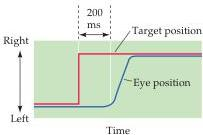

Eye Movements and Sensory Motor Integration 457

nerve carries axons that are responsible for pupillary constriction (see Chapter 11) from the nearby Edinger-Westphal nucleus.
Thus, damage to the third nerve results in three characteristic deficits: impairment of eye movements, drooping of the eyelid (ptosis), and pupillary dilation.

## Types of Eye Movements and Their Functions

There are four basic types of eye movements: saccades, smooth pursuit movements, vergence movements, and vestibulo-ocular movements.
The functions of each type of eye movement are introduced here; in subsequent sections, the neural circuitry responsible for three of these types of movements is presented in more detail (see Chapters 13 and 18 for further discussion of neural circuitry underlying vestibulo-ocular movements).

Saccades are rapid, ballistic movements of the eyes that abruptly change the point of fixation.
They range in amplitude from the small movements made while reading, for example, to the much larger movements made while gazing around a room.
Saccades can be elicited voluntarily, but occur reflexively whenever the eyes are open, even when fixated on a target (see Box A).
The rapid eye movements that occur during an important phase of sleep (see Chapter 27) are also saccades.
The time course of a saccadic eye movement is shown in Figure 19.4.
After the onset of a target for a saccade (in this example, the stimulus was the movement of an already fixated target), it takes about 200 milliseconds for eye movement to begin.
During this delay, the position of the target with respect to the fovea is computed (that is, how far the eye has to move), and the difference between the initial and intended position, or "motor error" (see Chapter 18), is converted into a motor command that activates the extraocular muscles to move the eyes the correct distance in the appropriate direction.
Saccadic eye movements are said to be ballistic because the saccade-generating system cannot respond to subsequent changes in the position of the target during the course of the eye movement.
If the target moves again during this time (which is on the order of $15 - 100\mathrm{ms}$), the saccade will miss the target, and a second saccade must be made to correct the error.

Smooth pursuit movements are much slower tracking movements of the eyes designed to keep a moving stimulus on the fovea.
Such movements are under voluntary control in the sense that the observer can choose whether or not to track a moving stimulus (Figure 19.5).
(Saccades can also be voluntary, but are also made unconsciously.) Surprisingly, however, only highly trained observers can make a smooth pursuit movement in the absence of a moving target.
Most people who try to move their eyes in a smooth fashion without a moving target simply make a saccade.

The smooth pursuit system can be tested by placing a subject inside a rotating cylinder with vertical stripes.
(In practice, the subject is more often seated in front of a screen on which a series of horizontally moving vertical bars is presented to conduct this "optokinetic test.") The eyes automatically follow a stripe until they reach the end of their excursion.
There is then a quick saccade in the direction opposite to the movement, followed once again by smooth pursuit of a stripe.
This alternating slow and fast movement of the eyes in response to such stimuli is called optokinetic nystagmus.
Optokinetic nystagmus is a normal reflexive response of the eyes in response to large-scale movements of the visual scene and should not be confused with the pathological nystagmus that can result from certain kinds of brain injury (for example, damage to the vestibular system or the cerebellum; see Chapters 13 and 18).

Figure 19.4 The metrics of a saccadic eye movement.
The red line indicates the position of a fixation target and the blue line the position of the fovea.
When the target moves suddenly to the right, there is a delay of about $200\mathrm{ms}$ before the eye begins to move to the new target position.
(After Fuchs, 1967.)