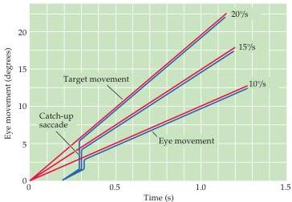

Chapter Nineteen

Figure 19.5 The metrics of smooth pursuit eye movements.
These traces show eye movements (blue lines) tracking a stimulus moving at three different velocities (red lines).
After a quick saccade to capture the target, the eye movement attains a velocity that matches the velocity of the target.
(After Fuchs, 1967.)

Vergence movements align the fovea of each eye with targets located at different distances from the observer.
Unlike other types of eye movements in which the two eyes move in the same direction (conjugate eye movements), vergence movements are disconjugate (or disjunctive); they involve either a convergence or divergence of the lines of sight of each eye to see an object that is nearer or farther away.
Convergence is one of the three reflexive visual responses elicited by interest in a near object.
The other components of the so-called near reflex triad are accommodation of the lens, which brings the object into focus, and pupillary constriction, which increases the depth of field and sharpens the image on the retina (see Chapter 10).

Vestibulo-ocular movements stabilize the eyes relative to the external world, thus compensating for head movements.
These reflex responses prevent visual images from "slipping" on the surface of the retina as head position varies.
The action of vestibulo-ocular movements can be appreciated by fixating an object and moving the head from side to side; the eyes automatically compensate for the head movement by moving the same distance but in the opposite direction, thus keeping the image of the object at more or less the same place on the retina.
The vestibular system detects brief, transient changes in head position and produces rapid corrective eye movements (see Chapter 13).
Sensory information from the semicircular canals directs the eyes to move in a direction opposite to the head movement.

Although the vestibular system operates effectively to counteract rapid movements of the head, it is relatively insensitive to slow movements or to persistent rotation of the head.
For example, if the vestibulo-ocular reflex is tested with continuous rotation and without visual cues about the movement of the image (i.e., with eyes closed or in the dark), the compensatory eye movements cease after only about 30 seconds of rotation.
However, if the same test is performed with visual cues, eye movements persist.
The compensatory eye movements in this case are due to the activation of the smooth pursuit system, which relies not on vestibular information but on visual cues indicating motion of the visual field.

## Neural Control of Saccadic Eye Movements

The problem of moving the eyes to fixate a new target in space (or indeed any other movement) entails two separate issues: controlling the amplitude of