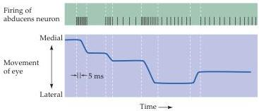
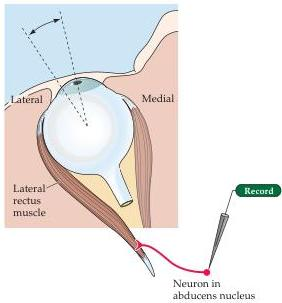

Eye Movements and Sensory Motor Integration 459

Figure 19.6 Motor neuron activity in relation to saccadic eye movements.
The experimental setup is shown on the right.
In this example, an abducens lower motor neuron fires a burst of activity (upper trace) that precedes and extends throughout the movement (solid line).
An increase in the tonic level of firing is associated with more lateral displacement of the eye.
Note also the decline in firing rate during a saccade in the opposite direction.
(After Fuchs and Luschei, 1970.)

movement (how far), and controlling the direction of the movement (which way).
The amplitude of a saccadic eye movement is encoded by the duration of neuronal activity in the lower motor neurons of the oculomotor nuclei.
As shown in Figure 19.6, for instance, neurons in the abducens nucleus fire a burst of action potentials prior to abducting the eye (by causing the lateral rectus muscle to contract) and are silent when the eye is adducted.
The amplitude of the movement is correlated with the duration of the burst of action potentials in the abducens neuron.
With each saccade, the abducens neurons reach a new baseline level of discharge that is correlated with the position of the eye in the orbit.
The steady baseline level of firing holds the eye in its new position.

The direction of the movement is determined by which eye muscles are activated.
Although in principle any given direction of movement could be specified by independently adjusting the activity of individual eye muscles, the complexity of the task would be overwhelming.
Instead, the direction of eye movement is controlled by the local circuit neurons in two gaze centers in the reticular formation, each of which is responsible for generating movements along a particular axis.
The paramedian pontine reticular formation (PPRF) or horizontal gaze center is a collection of local circuit neurons near the midline in the pons responsible for generating horizontal eye movements (Figure 19.7).
The rostral interstitial nucleus or vertical gaze center is located in the rostral part of the midbrain reticular formation and is responsible for vertical movements.
Activation of each gaze center separately results in movements of the eyes along a single axis, either horizontal or vertical.
Activation of the gaze centers in concert results in oblique movements whose trajectories are specified by the relative contribution of each center.

An example of how the PPRF works with the abducens and oculomotor nuclei to generate a horizontal saccade to the right is shown in Figure 19.7.
Neurons in the PPRF innervate cells in the abducens nucleus on the same side of the brain.
There are, however, two types of neurons in the abducens nucleus.
One type is a lower motor neuron that innervates the lateral rectus