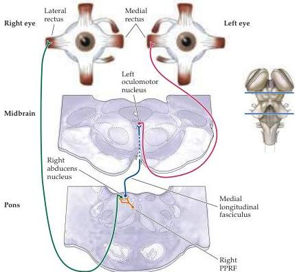

Chapter Nineteen

Figure 19.7 Simplified diagram of synaptic circuitry responsible for horizontal movements of the eyes to the right.
Activation of local circuit neurons in the right horizontal gaze center (the PPRF; orange) leads to increased activity of lower motor neurons (red and green) and internuclear neurons (blue) in the right abducens nucleus.
The lower motor neurons innervate the lateral rectus muscle of the right eye.
The internuclear neurons innervate lower motor neurons in the contralateral oculomotor nucleus, which in turn innervate the medial rectus muscle of the left eye.

muscle on the same side.
The other type, called internuclear neurons, send their axons across the midline and ascend in a fiber tract called the medial longitudinal fasciculus, terminating in the portion of the oculomotor nucleus that contains lower motor neurons innervating the medial rectus muscle.
As a result of this arrangement, activation of PPRF neurons on the right side of the brainstem causes horizontal movements of both eyes to the right; the converse is of course true for the PPRF neurons in the left half of the brainstem.

Neurons in the PPRF also send axons to the medullary reticular formation, where they contact inhibitory local circuit neurons.
These local circuit neurons, in turn, project to the contralateral abducens nucleus, where they terminate on lower motor neurons and internuclear neurons.
In consequence, activation of neurons in the PPRF on the right results in a reduction in the activity of the lower motor neurons whose muscles would oppose movements of the eyes to the right.
This inhibition of antagonists resembles the strategy used by local circuit neurons in the spinal cord to control limb muscle antagonists (see Chapter 15).

Although saccades can occur in complete darkness, they are often elicited when something attracts attention and the observer directs the foveas toward the stimulus.
How then is sensory information about the location of a target in space transformed into an appropriate pattern of activity in the horizontal and vertical gaze centers? Two structures that project to the gaze centers are demonstrably important for the initiation and accurate targeting of saccadic eye movements: the superior colliculus of the midbrain, and a region of the frontal lobe that lies just rostral to premotor cortex, known as