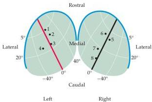
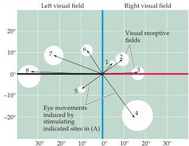

Eye Movements and Sensory Motor Integration 461

the frontal eye field (Brodmann's area 8).
Upper motor neurons in both of these structures, each of which contains a topographical motor map, discharge immediately prior to saccades.
Thus, activation of a particular site in the superior colliculus or in the frontal eye field produces saccadic eye movements in a specified direction and for a specified distance that is independent of the initial position of the eyes in the orbit.
The direction and distance are always the same for a given stimulation site, changing systematically when different sites are activated.

Both the superior colliculus and the frontal eye field also contain cells that respond to visual stimuli; however, the relation between the sensory and motor responses of individual cells is better understood for the superior colliculus.
An orderly map of visual space is established by the termination of retinal axons within the superior colliculus (see Chapter 11), and this sensory map is in register with the motor map that generates eye movements.
Thus, neurons in a particular region of the superior colliculus are activated by the presentation of visual stimuli in a limited region of visual space.
This activation leads to the generation of a saccade that moves the eye by an amount just sufficient to align the foveas with the region of visual space that provided the stimulation (Figure 19.8).

Neurons in the superior colliculus also respond to auditory and somatic stimuli.
Indeed, the location in space for these other modalities also is mapped in register with the motor map in the colliculus.
Topographically organized maps of auditory space and of the body surface in the superior colliculus can therefore orient the eyes (and the head) in response to a variety of different sensory stimuli.
This registration of the sensory and motor maps in the colliculus illustrates an important principle of topographical maps in the motor system, namely to provide an efficient mechanism for sensory motor transformations (Box B).

(A) Superior colliculus

(B) Visual space
Figure 19.8 Evidence for sensory motor transformation obtained from electrical recording and stimulation in the superior colliculus.
(A) Surface views of the superior colliculus illustrating the location of eight separate electrode recording and stimulation sites.
(B) Map of visual space showing the receptive field location of the sites in (A) (white circles), and the amplitude and direction of the eye movements elicited by stimulating these sites electrically (arrows).
In each case, electrical stimulation results in eye movements that align the fovea with a region of visual space that corresponds to the visual receptive field of the site.
(After Schiller and Stryker, 1972.)